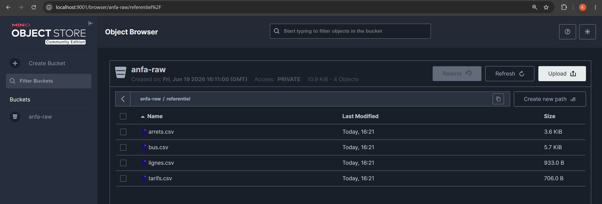

# Rendu Séance 1

Nom et prénom : ALLAGLO Kossiko

## Résumé de la séance

Pendant cette séance, nous avons préparé l'environnement de travail avec Docker, Docker Compose et Git. Nous avons ensuite lancé MinIO en local, créé un bucket `anfa-raw`, configuré une clé applicative et enfin écrit un script Python pour envoyer les fichiers CSV du référentiel Anfa vers MinIO.

## Étapes principales

1. Vérification de Docker, Docker Compose et Git.
2. Fork et clonage du dépôt GitHub du cours.
3. Création de la branche `seance-01`.
4. Création du dossier `seance-01/`.
5. Lancement de MinIO avec Docker.
6. Création du bucket `anfa-raw`.
7. Création de la clé applicative :
   - access key : `anfa-app-key`
   - secret key : `anfa-app-secret-2026`
8. Création de l'environnement Python et installation de `boto3`.
9. Écriture du script `upload_referentiel.py`.
10. Upload des fichiers CSV vers le préfixe `referentiel/` dans MinIO.
11. Ajout d'un fichier `docker-compose.yml` pour reprendre la configuration MinIO.

## Capture d'écran

La capture ci-dessous montre le bucket `anfa-raw` avec les fichiers CSV du référentiel Anfa dans le préfixe `referentiel/`.



## Difficultés rencontrées

Pas de blocage majeur. Le point le plus important était de bien distinguer les identifiants administrateur de MinIO et la clé applicative utilisée par le script Python. Il fallait aussi vérifier que Docker était bien accessible depuis l'environnement de travail.

## Exercices d'application

### Exercice 1 : QCM conceptuel

**1.1 Réponse : D. Open source obligatoire**

Justification : L'open source obligatoire ne fait pas partie des cinq caractéristiques essentielles du cloud computing selon le NIST.

**1.2 Réponse : C. SaaS**

Justification : Gmail est une application prête à l'emploi utilisée dans le navigateur, donc c'est un service SaaS.

**1.3 Réponse : D. FaaS**

Justification : Une fonction déclenchée à chaque arrivée de position GPS, sans serveur dédié permanent, correspond bien au modèle FaaS.

**1.4 Réponse : C. Cloud hybride**

Justification : Le cloud hybride permet de garder les données sensibles dans un environnement contrôlé tout en utilisant l'élasticité du cloud pour les traitements moins sensibles.

**1.5 Réponse : B. La situation où une entreprise ne peut plus changer de fournisseur sans coûts ou risques majeurs**

Justification : Le vendor lock-in désigne la dépendance forte à un fournisseur, qui rend une migration difficile ou coûteuse.

**1.6 Réponse : C. Un service open source est forcément moins performant qu'un service managé propriétaire**

Justification : Cette affirmation est fausse, car un outil open source peut être performant ; la différence dépend surtout de l'architecture, de l'exploitation et du niveau de service.

### Exercice 2 : Classification de services

| Service | Modèle | Justification |
| --- | --- | --- |
| Google Compute Engine (machine virtuelle) | IaaS | L'utilisateur loue une machine virtuelle et garde la main sur le système et les logiciels installés. |
| AWS Lambda | FaaS | Le code est exécuté sous forme de fonctions déclenchées par des événements, sans gestion de serveur. |
| Snowflake (entrepôt de données) | SaaS | L'utilisateur consomme directement un entrepôt de données managé sans gérer l'infrastructure. |
| Heroku | PaaS | Heroku fournit une plateforme pour déployer une application sans administrer les serveurs. |
| Microsoft 365 (Word, Excel en ligne) | SaaS | Ce sont des applications accessibles en ligne et prêtes à l'emploi. |
| Databricks (Spark managé) | PaaS | Databricks fournit une plateforme managée pour exécuter des traitements Spark et travailler sur les données. |
| Microsoft Azure Functions | FaaS | Le service exécute des fonctions déclenchées à la demande ou par événement. |
| Tableau Online | SaaS | L'utilisateur accède à un outil de tableau de bord déjà fourni sous forme de service web. |

### Exercice 3 : Lecture et interprétation

#### 3.1 Commande `docker run`

```bash
docker run -d --name analyse-anfa -p 8888:8888 -v /home/koffi/notebooks:/notebooks \
-e JUPYTER_TOKEN=anfa-token \
jupyter/pyspark-notebook
```

| Élément | Rôle |
| --- | --- |
| `-d` | Lance le conteneur en arrière-plan. |
| `--name analyse-anfa` | Donne le nom `analyse-anfa` au conteneur. |
| `-p 8888:8888` | Rend le port `8888` du conteneur accessible sur le port `8888` de la machine hôte. |
| `-v /home/koffi/notebooks:/notebooks` | Monte le dossier local `/home/koffi/notebooks` dans le conteneur à l'emplacement `/notebooks`. |
| `-e JUPYTER_TOKEN=anfa-token` | Définit la variable d'environnement `JUPYTER_TOKEN` avec la valeur `anfa-token`. |
| `jupyter/pyspark-notebook` | Indique l'image Docker utilisée pour créer le conteneur. |

Cette commande lance un environnement Jupyter avec PySpark dans un conteneur Docker nommé `analyse-anfa`. Les notebooks sont accessibles depuis la machine hôte sur le port `8888`, avec le token `anfa-token`, et les fichiers du dossier local sont disponibles dans le conteneur.

#### 3.2 Lecture d'un `docker-compose.yml`

**a. Adresses accessibles depuis le navigateur de l'hôte**

Le service est accessible sur :

- `http://localhost:9000` pour l'API S3 de MinIO ;
- `http://localhost:9001` pour la console web MinIO.

**b. Suppression du conteneur et relance**

Si on supprime seulement le conteneur `anfa-minio` puis qu'on relance `docker compose up -d`, les données ne sont pas perdues. Elles sont stockées dans le volume nommé `minio-data`, qui existe séparément du conteneur.

**c. Problème de sécurité**

Le fichier contient un mot de passe administrateur écrit en clair avec `MINIO_ROOT_PASSWORD: secret`. En production, il faudrait utiliser un vrai secret, une variable d'environnement protégée ou un gestionnaire de secrets.

### Exercice 4 : Diagnostic `InvalidAccessKeyId`

**a. Cause précise de l'erreur**

Le script utilise `anfa-admin` et `anfa-password-2026` comme identifiants S3, alors que le TP demande d'utiliser la clé applicative `anfa-app-key` et `anfa-app-secret-2026`.

**b. Correction du code**

```python
import boto3

s3 = boto3.client(
    "s3",
    endpoint_url="http://localhost:9000",
    aws_access_key_id="anfa-app-key",
    aws_secret_access_key="anfa-app-secret-2026",
    region_name="us-east-1",
)

s3.upload_file("trajets.csv", "anfa-raw", "trajets.csv")
```

**c. Pourquoi MinIO refuse ces identifiants dans ce contexte**

`anfa-admin` et `anfa-password-2026` servent à administrer MinIO et à se connecter à la console web. Pour un script applicatif, on utilise une clé d'accès dédiée ; cela évite de donner les droits administrateur à un programme et permet de mieux contrôler les accès.

### Exercice 5 : Mini-cas d'architecture

**a. Deux limites de l'architecture actuelle**

La première limite est que l'export CSV mensuel ne permet pas d'obtenir des prédictions presque en temps réel. La deuxième limite est que le PC du data scientist devient un point de blocage : il n'est pas adapté au partage, aux pics de calcul et à une exploitation régulière.

**b. Besoins et caractéristiques cloud du NIST**

| Besoin | Caractéristique cloud | Explication |
| --- | --- | --- |
| Prédictions chaque heure | Libre-service à la demande | Les ressources peuvent être déclenchées ou provisionnées quand le traitement est nécessaire. |
| Tableau de bord partagé sans installation locale | Accès réseau étendu | Les analystes peuvent accéder au tableau de bord depuis un navigateur. |
| Augmenter la capacité lors des pics | Élasticité rapide | Le cloud permet d'ajouter de la capacité pendant les périodes chargées puis de la réduire ensuite. |
| Maîtriser les coûts | Service mesuré | La consommation peut être suivie et facturée selon l'usage réel. |
| Conserver les données clients dans un environnement contrôlé | Mutualisation des ressources | Les ressources cloud peuvent être mutualisées tout en restant isolées par des droits, des réseaux et des règles d'accès. |

**c. Modèles de service proposés**

| Composant | Modèle | Justification |
| --- | --- | --- |
| Tableau de bord partagé | SaaS | Un outil comme Tableau Online ou Power BI en ligne permet aux analystes de consulter les tableaux de bord sans installation locale. |
| Calcul des prédictions à l'heure | FaaS | Une fonction planifiée peut lancer le calcul chaque heure sans laisser un serveur tourner en permanence. |
| Stockage des données clients | PaaS | Une base de données ou un stockage managé permet de garder les données avec sauvegardes, droits d'accès et supervision. |

**d. Modèle de déploiement recommandé**

Je recommande un cloud hybride. Les données clients sensibles peuvent rester dans un environnement privé ou fortement contrôlé, tandis que les traitements moins sensibles peuvent profiter de l'élasticité du cloud public pendant les pics.

**e. Trois stratégies pour limiter le vendor lock-in**

1. Utiliser des formats de données ouverts comme CSV, Parquet ou JSON.
2. Conteneuriser les traitements avec Docker pour faciliter le déplacement d'un environnement à un autre.
3. S'appuyer sur des outils et protocoles standards, par exemple du stockage compatible S3 comme MinIO et de l'infrastructure as code avec Terraform.
