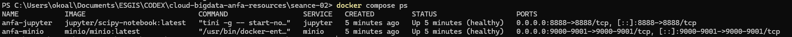
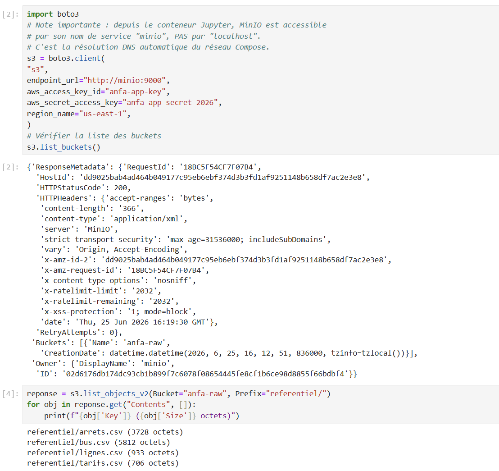

# Rendu - Séance 2

**Nom et prénom :** ALLAGLO Kossiko  
**Identifiant GitHub :** sunborndev  
**Date de soumission :** 25/06/2026

## Résumé de la séance

Pendant cette séance, nous avons conteneurisé une application PySpark qui analyse le référentiel Anfa. Nous avons construit une image Docker, vérifié son exécution avec les CSV montés en lecture seule, puis lancé un stack Docker Compose avec MinIO, Jupyter et notre application d'analyse. Nous avons aussi utilisé un notebook Jupyter pour lire les données stockées dans MinIO avec `boto3` et `pandas`.

## Étapes principales

1. Création de la branche `seance-02` à partir de `seance-01`.
2. Écriture du script `analyse_referentiel.py` avec PySpark.
3. Création du `Dockerfile` et construction de l'image `anfa-analyse:v1`.
4. Exécution de l'image avec le dossier `data/referentiel/` monté en lecture seule.
5. Ajout d'un `.dockerignore` dans `seance-02/` et observation du cache Docker.
6. Création du `docker-compose.yml` avec trois services : `minio`, `jupyter` et `anfa-app`.
7. Création du notebook `exploration_minio.ipynb`.
8. Lecture du bucket `anfa-raw` depuis Jupyter avec `boto3`, puis affichage des données avec `pandas`.
9. Réalisation du bonus multi-stage avec `Dockerfile.multistage`.

## Résultats observés

L'image `anfa-analyse:v1` a été construite correctement. Sa taille observée est de **1.17 GB**, ce qui est assez lourd, mais logique pour une image qui contient Java et PySpark.

Lors de l'exécution du conteneur, le script a affiché les résultats suivants :

- nombre de lignes de bus : `12` ;
- nombre d'arrêts uniques : `60` ;
- nombre total de bus : `100` ;
- bus actifs : `93` ;
- capacité totale de la flotte : `4538` places.

Le top 3 des lignes les plus longues est :

1. `Agoè Assiyéyé - Grand Marché` : `16.28 km`
2. `Baguida - Adawlato` : `13.13 km`
3. `Avédji - Adawlato` : `11.67 km`

## Cache Docker et `.dockerignore`

Après l'ajout du `.dockerignore`, nous avons reconstruit l'image. Le premier build avait pris plus de deux minutes, alors que le rebuild avec cache a duré environ **2.6 secondes**.

Docker a bien réutilisé les couches lourdes :

```text
CACHED [2/6] RUN apt-get update ...
CACHED [3/6] WORKDIR /app
CACHED [4/6] COPY requirements.txt .
CACHED [5/6] RUN pip install --no-cache-dir -r requirements.txt
```

Cela montre l'intérêt de copier `requirements.txt` avant le reste du code. Si on avait fait `COPY . .` avant `RUN pip install`, la moindre modification du script aurait relancé l'installation de PySpark, ce qui aurait fait perdre beaucoup de temps.

## Stack Docker Compose

Le fichier `docker-compose.yml` lance trois services :

- `minio` : stockage objet compatible S3 ;
- `jupyter` : environnement notebook accessible sur `http://localhost:8888` ;
- `anfa-app` : application PySpark construite depuis notre `Dockerfile`.

Le service `anfa-app` se termine en `Exited (0)`, ce qui est normal : c'est une application batch qui exécute l'analyse puis s'arrête. Les services `minio` et `jupyter` restent actifs.

## Captures d'écran

### docker compose ps



### Notebook Jupyter



## Notebook Jupyter

Dans le notebook `exploration_minio.ipynb`, nous avons utilisé l'endpoint `http://minio:9000`. C'est important : depuis le conteneur Jupyter, `localhost` désigne Jupyter lui-même, pas le conteneur MinIO.

Le notebook vérifie :

- la connexion à MinIO ;
- la présence du bucket `anfa-raw` ;
- la liste des fichiers dans `referentiel/` ;
- la lecture de `lignes.csv` avec `pandas` ;
- le top 3 des lignes les plus longues.

## Bonus multi-stage

Nous avons créé un fichier `Dockerfile.multistage` et construit l'image :

```text
anfa-analyse:v2-multistage
```

Comparaison des tailles observées :

| Image | Taille observée |
| --- | --- |
| `anfa-analyse:v1` | `1.17 GB` |
| `anfa-analyse:v2-multistage` | `1.17 GB` |

Dans notre cas, le multi-stage n'a pas réduit la taille finale. Ce résultat reste cohérent avec le TP : PySpark dépend de Java et de bibliothèques lourdes qui doivent rester présentes dans l'image finale. Le multi-stage est plus spectaculaire pour des applications compilées, mais il reste utile à connaître pour structurer proprement une image Docker.

## Réponses aux exercices d'application

### Exercice 1 : QCM conceptuel

**1.1 Réponse : C. Un conteneur partage le noyau de la machine hôte.**

Un conteneur n'embarque pas son propre noyau Linux : il utilise celui de l'hôte, ce qui explique en partie sa légèreté.

**1.2 Réponse : B. L'image est un modèle figé en lecture seule ; le conteneur est une instance en cours d'exécution.**

L'image sert de base, tandis que le conteneur est ce qui tourne réellement à partir de cette image.

**1.3 Réponse : B. Les namespaces.**

Les namespaces servent à isoler ce que voit un processus, par exemple les processus, le réseau ou les points de montage.

**1.4 Réponse : A. Les cgroups.**

Les cgroups permettent de limiter et contrôler les ressources utilisées par un conteneur, comme la mémoire ou le CPU.

**1.5 Réponse : B. Dans une machine virtuelle Linux invisible gérée par Docker Desktop.**

Sous macOS, Docker a besoin d'un environnement Linux, donc Docker Desktop le fournit via une machine virtuelle.

**1.6 Réponse : B. La société d'origine qui a créé et open-sourcé Docker en 2013.**

Docker vient de DotCloud, qui a ensuite publié Docker comme projet open source.

**1.7 Réponse : C. Docker a apporté un format d'image portable, une CLI simple et un registre public.**

Docker n'a pas inventé les primitives Linux, mais il les a rendues beaucoup plus faciles à utiliser et à partager.

**1.8 Réponse : B. Open Container Initiative, une norme ouverte pour les images et le runtime.**

L'OCI sert à standardiser les formats et runtimes de conteneurs pour éviter que chaque outil parte dans son propre sens.

### Exercice 2 : Lecture et analyse d'un Dockerfile

Dockerfile donné :

```Dockerfile
FROM python:3.11
WORKDIR /application
COPY . /application
RUN pip install -r requirements.txt
EXPOSE 5000
CMD ["python", "main.py"]
```

**2.1 Rôle de chaque instruction**

| Instruction | Explication |
| --- | --- |
| `FROM python:3.11` | Définit l'image de base, ici une image Python complète. |
| `WORKDIR /application` | Crée et utilise `/application` comme dossier de travail dans le conteneur. |
| `COPY . /application` | Copie tout le contenu du dossier courant dans l'image. |
| `RUN pip install -r requirements.txt` | Installe les dépendances Python pendant la construction de l'image. |
| `EXPOSE 5000` | Documente que l'application écoute sur le port `5000` dans le conteneur. |
| `CMD ["python", "main.py"]` | Définit la commande lancée au démarrage du conteneur. |

**2.2 Différence entre `EXPOSE 5000` et `-p 5000:5000`**

`EXPOSE 5000` ne publie pas le port sur la machine hôte. C'est surtout une information dans l'image. Pour accéder réellement au service depuis l'hôte, il faut lancer le conteneur avec `-p 5000:5000`.

**2.3 Problèmes et corrections**

| Problème | Pourquoi c'est gênant | Correction |
| --- | --- | --- |
| Image `python:3.11` trop large | Elle contient plus que nécessaire, donc l'image finale est plus lourde. | Utiliser `python:3.11-slim`. |
| `COPY .` avant `pip install` | À chaque changement du code, Docker peut perdre le cache de l'installation des dépendances. | Copier d'abord `requirements.txt`, installer, puis copier le reste. |
| Exécution en root | Ce n'est pas idéal pour la sécurité. | Créer un utilisateur applicatif et utiliser `USER`. |
| Risque de copier trop de fichiers | Sans `.dockerignore`, on peut envoyer des caches, fichiers temporaires ou secrets dans le build. | Ajouter un `.dockerignore`. |

**2.4 Version corrigée**

```Dockerfile
FROM python:3.11-slim

ENV PYTHONDONTWRITEBYTECODE=1 \
    PYTHONUNBUFFERED=1

WORKDIR /application

COPY requirements.txt .
RUN pip install --no-cache-dir -r requirements.txt

COPY . .

RUN adduser --disabled-password --gecos "" appuser
USER appuser

EXPOSE 5000
CMD ["python", "main.py"]
```

Cette version est plus légère, garde mieux le cache Docker et évite de lancer l'application avec l'utilisateur root.

### Exercice 3 : Diagnostic

#### 3.1 Le build qui échoue

**a. Cause précise de l'erreur**

Le fichier `requirements.txt` n'existe pas encore dans l'image au moment où Docker exécute `RUN pip install -r requirements.txt`.

**b. Correction du Dockerfile**

```Dockerfile
FROM python:3.11-slim

WORKDIR /app

COPY requirements.txt .
RUN pip install --no-cache-dir -r requirements.txt

COPY . .

CMD ["python", "main.py"]
```

**c. Pourquoi cette erreur montre une mauvaise compréhension de Docker**

Pendant un build, Docker n'a accès qu'aux fichiers déjà copiés dans l'image par les instructions précédentes. Le fait que `requirements.txt` existe sur la machine hôte ne suffit pas : il faut le copier avant de l'utiliser dans une commande `RUN`.

#### 3.2 Le conteneur qui ne voit pas l'autre

**a. Erreur dans `DATABASE_URL`**

L'erreur vient de `localhost`. Dans le conteneur `api`, `localhost` désigne le conteneur `api` lui-même, pas le conteneur PostgreSQL.

**b. Correction**

```yaml
DATABASE_URL: "postgresql://user:password@db:5432/anfa"
```

Dans Docker Compose, les services se joignent par leur nom de service. Ici, le service PostgreSQL s'appelle `db`, donc l'API doit utiliser `db` comme hôte.

### Exercice 4 : Optimisation d'image

**a. Problèmes identifiés**

| Problème | Explication |
| --- | --- |
| `ubuntu:22.04` comme base | C'est trop général et plus lourd qu'une image Python adaptée. |
| Plusieurs `RUN apt-get` séparés | Chaque `RUN` crée une couche et le cache apt n'est pas nettoyé proprement. |
| Installation de `git`, `wget`, `build-essential` | Ces outils ne sont pas forcément nécessaires pour une petite application avec seulement `requests`. |
| `COPY . /app` avant `pip install` | Une modification du code peut casser le cache des dépendances. |
| Pas de `--no-cache-dir` pour `pip` | Le cache pip peut gonfler l'image. |
| Application lancée en root | Ce n'est pas une bonne pratique de sécurité. |
| Pas de `.dockerignore` mentionné | On risque d'envoyer des fichiers inutiles ou sensibles au contexte Docker. |

**b. Version optimisée**

```Dockerfile
FROM python:3.11-slim-bookworm

# Évite les fichiers .pyc et rend les logs plus directs.
ENV PYTHONDONTWRITEBYTECODE=1 \
    PYTHONUNBUFFERED=1

WORKDIR /app

# On copie d'abord les dépendances pour garder le cache Docker.
COPY requirements.txt .
RUN pip install --no-cache-dir -r requirements.txt

# On copie le code après l'installation des dépendances.
COPY . .

# L'application ne tourne pas en root.
RUN adduser --disabled-password --gecos "" appuser
USER appuser

CMD ["python", "downloader.py"]
```

Ici, on part directement d'une image Python légère. On évite les paquets système inutiles, on protège le cache de `pip install`, et on lance le programme avec un utilisateur non-root.

### Exercice 5 : Mini-cas d'architecture

**a. Services à conteneuriser**

| Service | Rôle |
| --- | --- |
| `minio` | Stocker les données agrégées dans un bucket compatible S3. |
| `pipeline-gps` | Lire le fichier JSON Lines depuis le FTP, nettoyer les données et écrire le résultat dans MinIO. |
| `jupyter` | Explorer les données stockées dans MinIO et produire des graphiques. |

On peut aussi ajouter plus tard un service de planification, mais pour ce TP un lancement manuel ou planifié depuis l'extérieur de Compose suffit.

**b. Politique de redémarrage**

Nous choisirions `on-failure` pour le script Python. Le pipeline est un traitement batch : il doit s'arrêter quand il a fini, mais il peut être utile de le relancer automatiquement en cas d'erreur temporaire, par exemple si le FTP ou MinIO répond mal.

Nous éviterions `always` ou `unless-stopped`, parce que le script ne doit pas tourner en boucle comme un serveur.

**c. Rejouer le pipeline pour une date précise**

Deux mécanismes possibles :

1. Passer la date en variable d'environnement :

```powershell
docker compose run --rm -e RUN_DATE=2026-06-24 pipeline-gps
```

2. Passer la date comme argument de commande :

```powershell
docker compose run --rm pipeline-gps python pipeline.py --date 2026-06-24
```

Nous recommandons l'argument de commande pour un rejeu manuel, car il est explicite dans la commande lancée. Pour une exécution planifiée, une variable d'environnement comme `RUN_DATE` peut être plus pratique.

**d. Pourquoi ne pas mettre le script dans le conteneur Jupyter ?**

Jupyter sert surtout à explorer et tester. Le pipeline, lui, doit être reproductible, lançable sans interface graphique, journalisé et rejouable pour une date donnée. En séparant les deux conteneurs, on évite de mélanger l'analyse interactive et le traitement de production. C'est plus propre pour déboguer, relancer et automatiser.

**e. Squelette de `docker-compose.yml`**

```yaml
services:
  minio:
    image: minio/minio:latest
    ports:
      - "9000:9000"
      - "9001:9001"
    environment:
      MINIO_ROOT_USER: anfa-admin
      MINIO_ROOT_PASSWORD: anfa-password-2026
    volumes:
      - minio-data:/data
    command: server /data --console-address ":9001"

  pipeline-gps:
    build: ./pipeline
    restart: on-failure
    environment:
      FTP_URL: ftp://ftp-anfa.example/gps
      MINIO_ENDPOINT: http://minio:9000
      RUN_DATE: ${RUN_DATE:-latest}
    depends_on:
      - minio

  jupyter:
    image: jupyter/scipy-notebook:latest
    ports:
      - "8888:8888"
    volumes:
      - ./notebooks:/home/jovyan/work
    depends_on:
      - minio

volumes:
  minio-data:
```

Les services partagent le réseau implicite de Docker Compose. Le pipeline et Jupyter peuvent donc joindre MinIO avec l'adresse `http://minio:9000`, comme dans notre TP.

## Difficultés rencontrées

Nous avons rencontré un conflit de nom avec l'ancien conteneur `anfa-minio` de la séance 1. Il a fallu l'arrêter et le supprimer avant de lancer le stack Compose, car le nouveau service MinIO devait utiliser le même nom et les mêmes ports.

Nous avons aussi dû recréer le bucket `anfa-raw` et la clé applicative `anfa-app-key` dans l'instance MinIO lancée par Compose. Le notebook renvoyait `InvalidAccessKeyId`, ce qui indiquait que la clé n'existait pas encore dans ce nouveau volume MinIO.

Enfin, nous avons corrigé une petite erreur d'indentation dans une cellule Python du notebook. Après correction, la liste des objets MinIO et le tableau pandas se sont affichés correctement.
