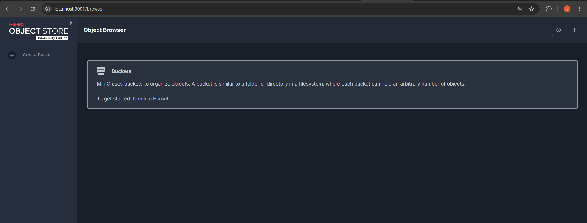
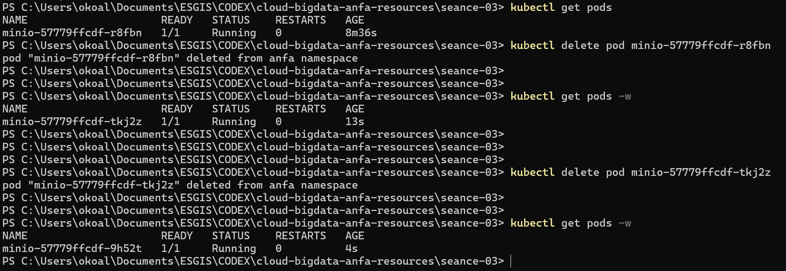
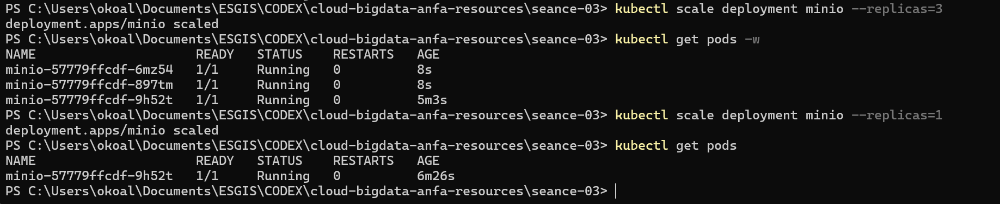

# Rendu Séance 3

**Nom et prénom :** ALLAGLO Kossiko  
**Identifiant GitHub :** sunborndev  
**Date de soumission :** 26/06/2026

## Résumé de la séance

Pendant cette séance, nous avons créé un cluster Kubernetes local avec Kind, puis déployé MinIO dans un namespace dédié `anfa`. Le déploiement a été fait avec trois manifestes YAML : un PVC pour le stockage, un Deployment pour le pod MinIO et un Service pour l'exposer. Nous avons aussi observé le self-healing, testé le scaling du Deployment et activé l'Ingress Controller nginx.

## Étapes principales

1. Vérification de `kind` et `kubectl`.
2. Création du cluster Kind `anfa`.
3. Création du namespace Kubernetes `anfa`.
4. Déploiement de MinIO avec `minio-pvc.yaml`, `minio-deployment.yaml` et `minio-service.yaml`.
5. Accès à la console MinIO avec `kubectl port-forward`.
6. Suppression manuelle d'un pod MinIO pour observer le self-healing.
7. Scaling du Deployment MinIO de 1 à 3 replicas, puis retour à 1 replica.
8. Installation et vérification de l'Ingress Controller nginx.

## Résultats observés

Le cluster Kind a été créé avec l'image `kindest/node:v1.35.1`. Le nœud `anfa-control-plane` est passé en statut `Ready`.

Le namespace `anfa` a été créé et configuré comme namespace par défaut. Le PVC `minio-pvc` est passé en statut `Bound` avec une capacité de `2Gi`. Le Deployment `minio` est passé en `1/1`, et le pod MinIO était bien en `Running`.

Le Service `minio` est de type `NodePort` et expose :

- `9000:30900/TCP` pour l'API ;
- `9001:30901/TCP` pour la console.

Comme nous utilisons Kind, nous avons utilisé `kubectl port-forward` pour accéder à la console MinIO depuis le navigateur.

## Captures d'écran

### Console MinIO



### Self-healing



### Scaling à 3 replicas



## Self-healing

Nous avons supprimé manuellement un pod MinIO avec `kubectl delete pod`. Kubernetes a recréé automatiquement un nouveau pod, avec un nouveau suffixe dans son nom.

Ce comportement vient du Deployment : son état souhaité indique qu'il doit toujours y avoir 1 replica. Quand le pod disparaît, Kubernetes constate l'écart entre l'état réel et l'état souhaité, puis recrée un pod.

## Scaling

Nous avons utilisé :

```powershell
kubectl scale deployment minio --replicas=3
```

Kubernetes a créé deux pods supplémentaires pour atteindre 3 replicas. Ensuite, nous sommes revenus à 1 replica :

```powershell
kubectl scale deployment minio --replicas=1
```

Le but ici était surtout d'observer la mécanique de scaling Kubernetes. Pour MinIO en production, une vraie configuration distribuée demanderait une architecture plus propre.

## Ingress Controller

Nous avons installé l'Ingress Controller nginx pour Kind. Le téléchargement de l'image a pris du temps, donc le pod est resté un moment en `ContainerCreating`. Après la fin du téléchargement, le pod `ingress-nginx-controller` est passé en `1/1 Running`.

L'objectif ici n'était pas encore de créer une ressource `Ingress`, mais de comprendre que l'Ingress Controller est lui-même un composant qui tourne dans Kubernetes.

## Réponses aux exercices d'application

### Exercice 1 : QCM conceptuel

**1.1 Réponse : B. Kubernetes orchestre des conteneurs sur un cluster de machines.**

Kubernetes ne remplace pas Docker directement : il orchestre des conteneurs en s'appuyant sur un runtime comme containerd, Docker ou CRI-O.

**1.2 Réponse : B. etcd.**

`etcd` stocke l'état complet du cluster, un peu comme la mémoire centrale de Kubernetes.

**1.3 Réponse : C. Scheduler.**

Le Scheduler choisit le nœud sur lequel placer un nouveau pod.

**1.4 Réponse : C. À l'API Server.**

`kubectl` parle à l'API Server, qui est le point d'entrée du cluster.

**1.5 Réponse : B. Le Deployment recrée un nouveau pod.**

Si le pod est géré par un Deployment, Kubernetes le recrée pour respecter l'état souhaité.

**1.6 Réponse : B. NodePort.**

Un Service `NodePort` expose un service sur un port du nœud, sans dépendre d'un load balancer cloud.

**1.7 Réponse : B. Elle modifie l'état souhaité du Deployment à 5 replicas.**

Kubernetes va ensuite faire converger l'état réel vers ce nombre.

**1.8 Réponse : B. Isoler logiquement les ressources.**

Un namespace sert à séparer les ressources par projet, application, équipe ou environnement.

**1.9 Réponse : B. Des conteneurs Docker.**

Avec Kind, les nœuds Kubernetes tournent eux-mêmes dans des conteneurs Docker.

### Exercice 2 : Lecture et interprétation d'un manifeste

**2.1 Lien entre `selector.matchLabels` et `template.metadata.labels`**

`selector.matchLabels` indique quels pods sont gérés par le Deployment. Les labels dans `template.metadata.labels` doivent correspondre, sinon le Deployment ne saura pas retrouver ses propres pods.

**2.2 Nombre de pods et comportement si un pod meurt**

Le Deployment crée 2 pods, car `replicas: 2`. Si un pod meurt, Kubernetes en recrée un autre pour revenir à 2 pods disponibles.

**2.3 Pourquoi utiliser `http://minio:9000`**

On utilise `minio` parce que Kubernetes résout les noms de Services via DNS interne. C'est plus stable qu'une adresse IP de pod, car les IP des pods peuvent changer.

**2.4 Conséquence de l'absence de Service**

Sans Service, l'API n'a pas d'adresse réseau stable dans le cluster. Les pods existent, mais les autres composants ne peuvent pas les appeler proprement par un nom fixe.

**2.5 Service interne pour l'API**

```yaml
apiVersion: v1
kind: Service
metadata:
  name: anfa-api
  namespace: anfa
spec:
  type: ClusterIP
  selector:
    app: anfa-api
  ports:
    - name: http
      port: 80
      targetPort: 8000
```

Ce Service expose l'API uniquement à l'intérieur du cluster, sur le port `80`, tout en redirigeant vers le port `8000` des conteneurs.

### Exercice 3 : Diagnostic

#### 3.1 Le pod qui ne démarre pas

**a. Signification de `ImagePullBackOff`**

Cela veut dire que Kubernetes n'arrive pas à télécharger l'image du conteneur et qu'il réessaie avec un délai.

**b. Cause probable**

La cause probable est une faute dans le nom de l'image : `minio/miniooo:latest` au lieu de `minio/minio:latest`.

**c. Commande de diagnostic**

```powershell
kubectl describe pod minio-7d9f8b6c5-x2k9p
```

Cette commande affiche les événements du pod, dont les erreurs liées au téléchargement d'image.

#### 3.2 Le PVC qui ne se lie pas

**a. Signification de `Pending`**

Un PVC en `Pending` signifie que Kubernetes n'a pas encore trouvé ou provisionné un volume correspondant à la demande.

**b. Cause probable**

Dans un cluster Kind local, demander `500Gi` est probablement trop élevé par rapport aux ressources disponibles.

**c. Commande de diagnostic**

```powershell
kubectl describe pvc data-pvc
```

On peut aussi vérifier les StorageClass :

```powershell
kubectl get storageclass
```

#### 3.3 Le port-forward qui échoue

**a. Cause de l'erreur**

Le port-forward échoue parce que le pod ciblé par le Service n'est pas encore en état `Running`.

**b. Commande pour comprendre pourquoi le pod est `Pending`**

```powershell
kubectl describe pod <nom-du-pod>
```

**c. Ordre logique**

Il faut d'abord vérifier le PVC, puis le pod, puis le Deployment et le Service. Le port-forward doit venir seulement quand le pod est bien `Running`.

### Exercice 4 : De Docker Compose à Kubernetes

**4.1 Manifestes nécessaires**

Pour reproduire le service MinIO de Compose en Kubernetes, il faut au minimum 3 manifestes :

- un `PersistentVolumeClaim` pour demander le stockage persistant ;
- un `Deployment` pour lancer et maintenir le pod MinIO ;
- un `Service` pour donner une adresse réseau stable et exposer MinIO.

**4.2 Volume Docker nommé vs PVC Kubernetes**

En Docker Compose, un volume nommé est directement géré par Docker sur la machine locale. En Kubernetes, un PVC est une demande de stockage : le cluster cherche ou provisionne un volume qui répond à cette demande. C'est plus abstrait, mais aussi plus adapté à un cluster.

**4.3 Pourquoi utiliser `kubectl port-forward` avec Kind**

Avec Compose, les ports sont directement publiés sur l'hôte avec `ports`. Avec Kind, le cluster tourne dans un conteneur Docker, donc un `NodePort` n'est pas forcément accessible directement depuis Windows. `kubectl port-forward` crée un tunnel simple entre la machine locale et le Service Kubernetes.

Pour accéder directement à MinIO comme avec Compose, il faudrait configurer le cluster Kind avec des mappings de ports ou utiliser un vrai load balancer dans un environnement cloud.

**4.4 Ce que Kubernetes apporte par rapport à Compose**

Kubernetes apporte le self-healing : quand nous avons supprimé le pod MinIO, il a été recréé automatiquement. Il apporte aussi le scaling : nous avons pu passer le Deployment de 1 à 3 replicas avec une seule commande.

### Exercice 5 : Mini-cas d'architecture

**5.1 Type d'objet Kubernetes par composant**

| Composant | Objet Kubernetes | Justification |
| --- | --- | --- |
| `pipeline-anfa` | `CronJob` | Le pipeline doit tourner automatiquement chaque nuit à 2 h. |
| `anfa-api` | `Deployment` | L'API doit rester disponible en continu et supporter plusieurs replicas. |
| `anfa-dashboard` | `Deployment` | Grafana est un service web consulté en journée, donc un Deployment suffit. |

**5.2 HPA pour `anfa-api`**

Nous choisirions par exemple :

- `minReplicas: 2`
- `maxReplicas: 10`
- cible CPU : `60%`

L'API reçoit environ 50 requêtes/seconde aux heures de pointe et seulement 5 le reste du temps. Garder au moins 2 replicas évite un point unique de panne, et monter jusqu'à 10 permet d'absorber les pics sans surdimensionner en permanence.

**5.3 Type de Service pour `anfa-api`**

Nous choisirions `LoadBalancer`, car l'API doit être accessible par les applications mobiles des conducteurs depuis l'extérieur du cluster. Dans un cluster Kubernetes managé, le fournisseur cloud peut créer automatiquement un load balancer externe.

**5.4 Mise à jour sans coupure**

Kubernetes gère les mises à jour de Deployment avec un rolling update. Il crée progressivement de nouveaux pods avec la nouvelle version, puis supprime les anciens quand les nouveaux sont prêts. Cela évite de couper tout le service d'un coup, surtout si plusieurs replicas tournent déjà.

**5.5 Squelette de Deployment pour `anfa-api`**

```yaml
apiVersion: apps/v1
kind: Deployment
metadata:
  name: anfa-api
  namespace: anfa
spec:
  replicas: 3
  selector:
    matchLabels:
      app: anfa-api
  template:
    metadata:
      labels:
        app: anfa-api
    spec:
      containers:
        - name: api
          image: anfa/api:v1
          ports:
            - containerPort: 8000
          env:
            - name: MINIO_ENDPOINT
              value: "http://minio:9000"
```

Ce Deployment lance 3 pods de l'API et leur donne l'endpoint MinIO interne au cluster.

## Difficultés rencontrées

Le téléchargement de l'image de l'Ingress Controller a pris du temps. Le pod est resté plusieurs minutes en `ContainerCreating`, mais les événements montraient que l'image était encore en cours de téléchargement. Une fois le pull terminé, le pod est passé en `Running`.

Le point le plus important à retenir est que Kubernetes ne fonctionne pas comme Docker Compose. Il faut séparer le stockage, le déploiement et le réseau dans plusieurs objets YAML, puis vérifier chaque ressource avec `kubectl`.
