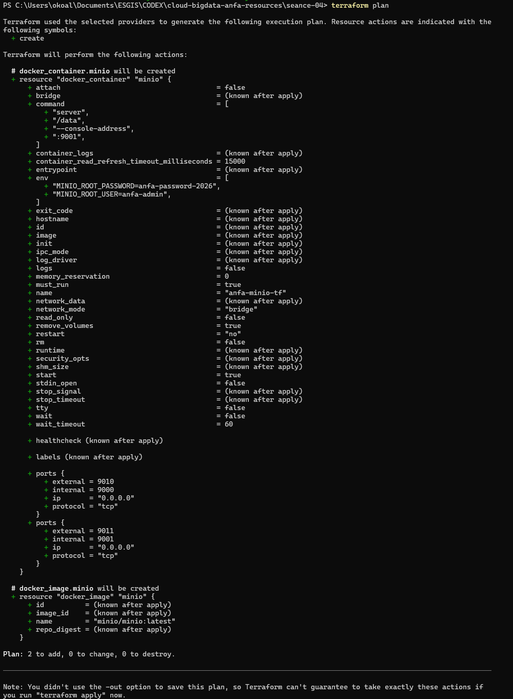
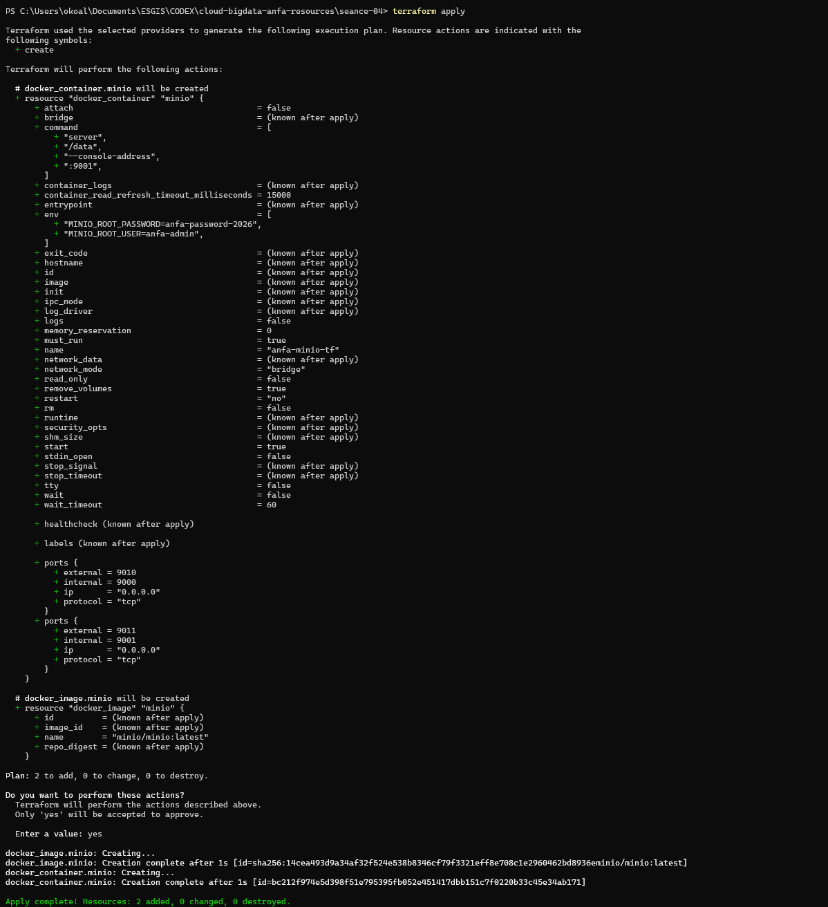
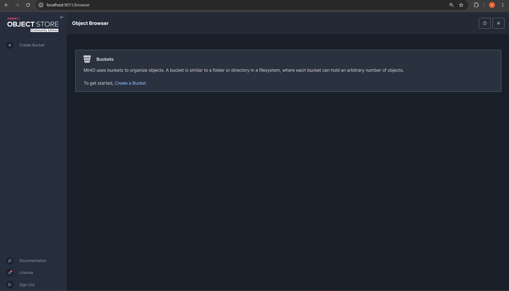
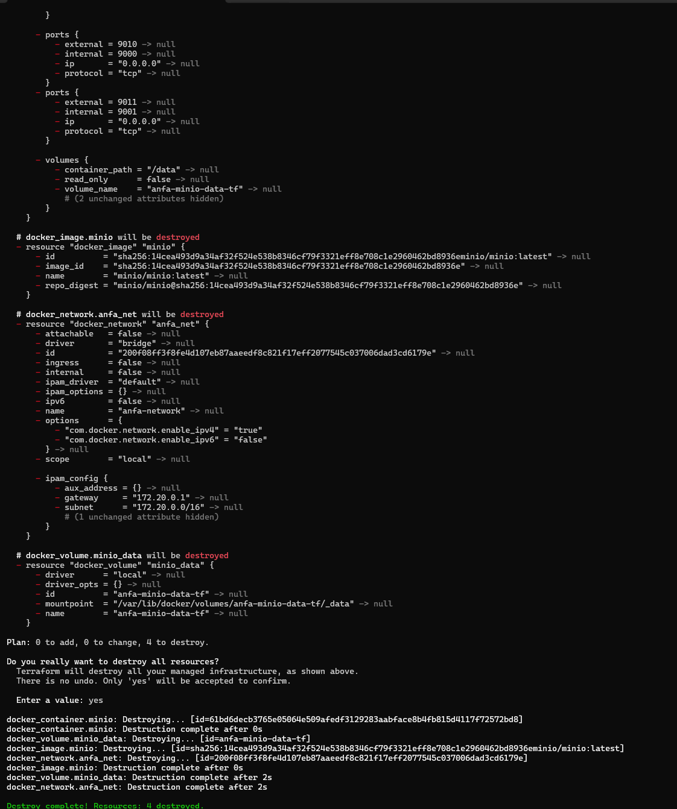

# Rendu - Séance 4

**Nom et prénom :** ALLAGLO Kossiko  
**Identifiant GitHub :** sunborndev  
**Date de soumission :** 30/06/2026

## Résumé de la séance

Pendant cette séance, nous avons utilisé Terraform pour décrire une infrastructure Docker en code. Nous avons commencé avec un conteneur MinIO simple, puis nous avons ajouté un réseau, un volume persistant et des variables. Nous avons aussi vu le rôle du state Terraform et pourquoi il ne doit pas être envoyé sur GitHub.

## Étapes principales

1. Installation et vérification de Terraform.
2. Création d'un premier `main.tf` minimal pour lancer MinIO.
3. Utilisation du workflow `terraform init`, `terraform plan`, `terraform apply`.
4. Vérification du conteneur MinIO créé par Terraform.
5. Observation du state Terraform et ajout d'un `.gitignore` adapté.
6. Passage à une stack complète avec réseau Docker, volume Docker et conteneur MinIO.
7. Refactoring avec `variables.tf`, `terraform.tfvars` et `terraform.tfvars.example`.
8. Destruction propre de l'infrastructure avec `terraform destroy`.

## Résultats observés

Le premier `terraform plan` a annoncé :

```text
Plan: 2 to add, 0 to change, 0 to destroy.
```

Terraform devait créer l'image Docker MinIO et le conteneur `anfa-minio-tf`.

Après `terraform apply`, l'infrastructure a été créée correctement :

```text
Apply complete! Resources: 2 added, 0 changed, 0 destroyed.
```

Après le passage à la version complète, Terraform a géré une infrastructure composée de :

- un réseau Docker `anfa-network` ;
- un volume Docker `anfa-minio-data-tf` ;
- l'image `minio/minio:latest` ;
- le conteneur `anfa-minio-tf`.

Après ajout des variables, Terraform a détecté une petite mise à jour liée au fait que le mot de passe est devenu une valeur sensible. Une fois appliquée, la configuration était propre.

À la fin, `terraform destroy` a supprimé les ressources gérées par Terraform :

```text
Destroy complete! Resources: 4 destroyed.
```

## Captures d'écran

### terraform plan



### terraform apply



### Console MinIO créée par Terraform



### terraform destroy



## State Terraform et fichiers ignorés

Terraform crée un fichier `terraform.tfstate` pour mémoriser ce qu'il a créé. Ce fichier peut contenir des informations sensibles, par exemple des mots de passe ou des identifiants. Pour cette raison, il ne doit pas être commit.

Dans `seance-04/.gitignore`, nous avons ignoré :

- `.terraform/`
- `.terraform.lock.hcl`
- `*.tfstate`
- `*.tfstate.*`
- `*.tfvars`

Le fichier `terraform.tfvars.example` reste versionné, car il sert seulement de modèle sans vrai secret.

## Réponses aux exercices d'application

### Exercice 1 - QCM conceptuel

**1.1 Réponse : B. L'IaC remplace totalement la nécessité de comprendre l'infrastructure sous-jacente.**

Cette affirmation est fausse : l'IaC aide à automatiser, mais il faut toujours comprendre ce qu'on déploie.

**1.2 Réponse : B. Le déclaratif décrit l'état souhaité ; l'impératif décrit la séquence d'actions.**

Avec Terraform, on décrit surtout le résultat attendu, pas toutes les commandes manuelles à exécuter.

**1.3 Réponse : B. Elle produit le même résultat quel que soit le nombre de fois où elle est appliquée.**

C'est ce qu'on a vu avec Terraform : si rien ne change, il n'a rien à refaire.

**1.4 Réponse : B. Un provider est un plugin qui sait communiquer avec une API spécifique.**

Dans notre cas, le provider Docker permet à Terraform de parler au moteur Docker.

**1.5 Réponse : B. Terraform compare le state au code et n'effectue aucune action.**

Si l'infrastructure correspond déjà au code, `terraform apply` ne recrée pas tout.

**1.6 Réponse : C. Mémoriser ce que Terraform a créé.**

Le fichier `terraform.tfstate` permet à Terraform de suivre les ressources existantes et leurs changements.

**1.7 Réponse : B. Il peut contenir des secrets en clair et poser des problèmes en équipe.**

Le state peut contenir des mots de passe, et deux personnes qui modifient le même state peuvent créer des conflits.

**1.8 Réponse : C. `terraform plan`.**

`terraform plan` permet de vérifier ce qui va changer avant d'appliquer.

**1.9 Réponse : B. Un fork open source de Terraform créé après le changement de licence de HashiCorp en 2023.**

OpenTofu reprend l'idée de Terraform avec une gouvernance open source.

**1.10 Réponse : B. Terraform provisionne l'infrastructure, Ansible configure des machines existantes.**

Les deux outils peuvent se compléter : Terraform crée les ressources, Ansible peut configurer ce qui tourne dessus.

### Exercice 2 - Lecture et interprétation d'un fichier Terraform

**2.1 Les 4 resources**

| Resource | Rôle |
| --- | --- |
| `docker_network.back` | Crée le réseau Docker `anfa-backend`. |
| `docker_volume.data` | Crée le volume Docker `postgres-data` pour persister les données. |
| `docker_image.postgres` | Télécharge ou référence l'image `postgres:15`. |
| `docker_container.db` | Lance le conteneur PostgreSQL avec ses ports, variables, volume et réseau. |

**2.2 Référence `docker_image.postgres.image_id`**

`docker_image.postgres.image_id` récupère l'identifiant réel de l'image gérée par Terraform. C'est mieux que d'écrire directement `"postgres:15"`, car Terraform comprend la dépendance entre l'image et le conteneur.

**2.3 Ordre de création**

Terraform va créer d'abord les ressources indépendantes : réseau, volume et image. Ensuite il crée le conteneur, parce que celui-ci référence l'image, le réseau et le volume.

**2.4 Problème de sécurité**

Le mot de passe PostgreSQL est écrit en clair dans le code :

```hcl
"POSTGRES_PASSWORD=secret123"
```

Une meilleure version consiste à utiliser une variable sensible :

```hcl
variable "postgres_password" {
  type      = string
  sensitive = true
}

env = [
  "POSTGRES_DB=anfa",
  "POSTGRES_USER=anfa_user",
  "POSTGRES_PASSWORD=${var.postgres_password}",
]
```

La vraie valeur peut ensuite être fournie dans un fichier `terraform.tfvars` ignoré par Git.

**2.5 Modification du port après destroy**

Si l'étudiant fait `terraform destroy`, toutes les ressources gérées sont supprimées. Ensuite, s'il modifie `external = 5432` en `external = 5433` puis relance `terraform apply`, Terraform recrée l'infrastructure avec le nouveau port exposé.

### Exercice 3 - Diagnostic

#### 3.1 Dépendance circulaire

**a. Signification**

Terraform détecte que `container-a` dépend de `container-b`, et que `container-b` dépend aussi de `container-a`.

**b. Pourquoi Terraform refuse**

Il ne peut pas décider quel conteneur créer en premier. Chaque ressource attend l'autre, donc le graphe de dépendances forme un cycle.

**c. Solution**

Il faut casser la dépendance circulaire. Par exemple, on peut utiliser une valeur fixe ou un réseau commun au lieu de faire dépendre les deux conteneurs l'un de l'autre :

```hcl
env = ["LINKED_TO=container-b"]
```

ou passer par un mécanisme de découverte de service plus propre.

#### 3.2 Le plan qui veut recréer le conteneur

**a. Pourquoi `-/+` au lieu de `~`**

Certaines propriétés d'un conteneur Docker, comme les variables d'environnement, ne sont pas toujours modifiables à chaud. Terraform doit donc supprimer et recréer le conteneur.

**b. Les données du volume sont-elles perdues ?**

Non, si les données sont dans un volume Docker séparé. Le conteneur peut être recréé, mais le volume reste présent tant qu'il n'est pas détruit.

**c. Impact en production**

Ce n'est pas gratuit en production. Recréer un conteneur peut provoquer une interruption de service, même courte. Il faut donc prévoir des replicas, une stratégie de déploiement, ou une fenêtre de maintenance.

#### 3.3 Le state corrompu

**a. Problème de sécurité**

Le fichier `terraform.tfstate` peut contenir des secrets en clair. En le poussant sur GitHub, l'étudiant expose potentiellement des mots de passe ou des clés.

**b. Risque technique**

Awa peut appliquer Terraform avec un state qui ne correspond pas exactement à sa machine ou à son environnement. Elle risque de modifier ou supprimer des ressources qu'elle ne maîtrise pas.

**c. Solution pérenne**

Il faut utiliser un backend distant sécurisé, avec verrouillage du state, par exemple Terraform Cloud, S3 compatible avec verrouillage, ou un backend prévu pour le travail en équipe. Il faut aussi retirer le state de Git et renouveler les secrets exposés.

### Exercice 4 - Adaptation Compose vers Terraform

Voici un squelette Terraform propre pour traduire MinIO + Jupyter :

```hcl
terraform {
  required_providers {
    docker = {
      source  = "kreuzwerker/docker"
      version = "~> 3.0"
    }
  }
}

provider "docker" {}

variable "minio_root_password" {
  type      = string
  sensitive = true
}

resource "docker_network" "anfa_net" {
  name = "anfa-network"
}

resource "docker_volume" "minio_data" {
  name = "minio-data"
}

resource "docker_image" "minio" {
  name = "minio/minio:latest"
}

resource "docker_image" "jupyter" {
  name = "jupyter/scipy-notebook:latest"
}

resource "docker_container" "minio" {
  name  = "anfa-minio"
  image = docker_image.minio.image_id

  command = ["server", "/data", "--console-address", ":9001"]

  env = [
    "MINIO_ROOT_USER=anfa-admin",
    "MINIO_ROOT_PASSWORD=${var.minio_root_password}",
  ]

  ports {
    internal = 9000
    external = 9000
  }

  ports {
    internal = 9001
    external = 9001
  }

  volumes {
    volume_name    = docker_volume.minio_data.name
    container_path = "/data"
  }

  networks_advanced {
    name = docker_network.anfa_net.name
  }
}

resource "docker_container" "jupyter" {
  name  = "anfa-jupyter"
  image = docker_image.jupyter.image_id

  env = [
    "JUPYTER_TOKEN=anfa-token",
  ]

  ports {
    internal = 8888
    external = 8888
  }

  networks_advanced {
    name = docker_network.anfa_net.name
  }
}
```

Terraform comprend les dépendances grâce aux références : le conteneur MinIO dépend de son image, du réseau et du volume. Jupyter dépend aussi de son image et du réseau.

### Exercice 5 - Mini-cas d'architecture

**5.1 Resources Terraform à prévoir**

Nous prévoirions au minimum :

- un réseau privé cloud ;
- un bucket de stockage objet pour les données brutes ;
- un cluster Kubernetes managé ;
- un registre d'images Docker ;
- une base de données managée si l'API en a besoin ;
- un load balancer public pour Grafana ou l'API ;
- des règles de sécurité réseau ;
- des variables/secrets pour les mots de passe et tokens.

**5.2 Un seul gros `main.tf` ou plusieurs fichiers**

Nous recommandons plusieurs fichiers : `network.tf`, `storage.tf`, `compute.tf`, `monitoring.tf`. C'est plus lisible, plus facile à relire en équipe et plus simple à maintenir. Un seul fichier de 800 lignes devient vite difficile à comprendre, surtout quand plusieurs personnes travaillent dessus.

**5.3 Deux mécanismes pour gérer `dev` et `prod`**

Deux mécanismes utiles :

1. Des fichiers de variables séparés, par exemple `dev.tfvars` et `prod.tfvars`.
2. Des workspaces Terraform, par exemple `terraform workspace new dev` et `terraform workspace new prod`.

On peut aussi utiliser des modules pour partager la même structure entre environnements.

**5.4 Migration vers un autre fournisseur cloud**

Terraform aide, mais la migration ne sera pas magique. Les fichiers HCL donnent une bonne base, surtout pour la structure générale : réseau, stockage, Kubernetes, monitoring. Par contre, les providers changent, les noms de ressources changent et certains services n'ont pas exactement les mêmes options entre OVHcloud et AWS. Il faudra donc adapter le code, tester les plans, migrer les données et revoir les coûts. Ce sera plus simple qu'une infrastructure créée à la main, mais ce ne sera pas instantané.

**5.5 Bonnes pratiques en équipe**

Nous mettrions en place :

1. Un backend distant sécurisé pour le state, avec verrouillage.
2. Une règle stricte : ne jamais committer `terraform.tfstate`, `*.tfvars` ou des secrets.
3. Des pull requests avec revue avant chaque changement Terraform.
4. Un `terraform plan` obligatoire avant `apply`.
5. Une séparation claire entre environnements `dev` et `prod`.

## Difficultés rencontrées

Pas de gros blocage. Le point le plus important était de bien comprendre que Terraform garde un state local et que ce state peut contenir des secrets. Nous avons aussi vu que certains changements, comme les variables d'environnement Docker, peuvent forcer Terraform à modifier ou recréer un conteneur selon le cas.
