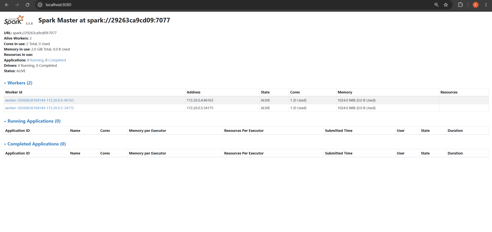
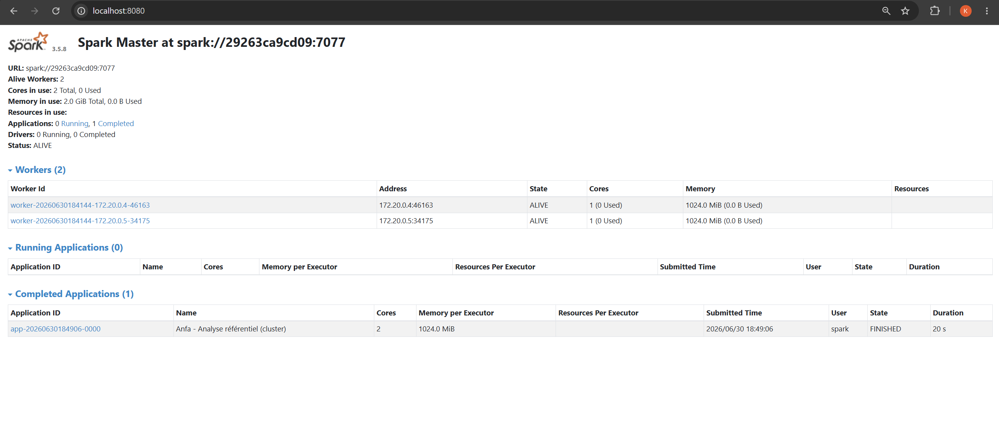
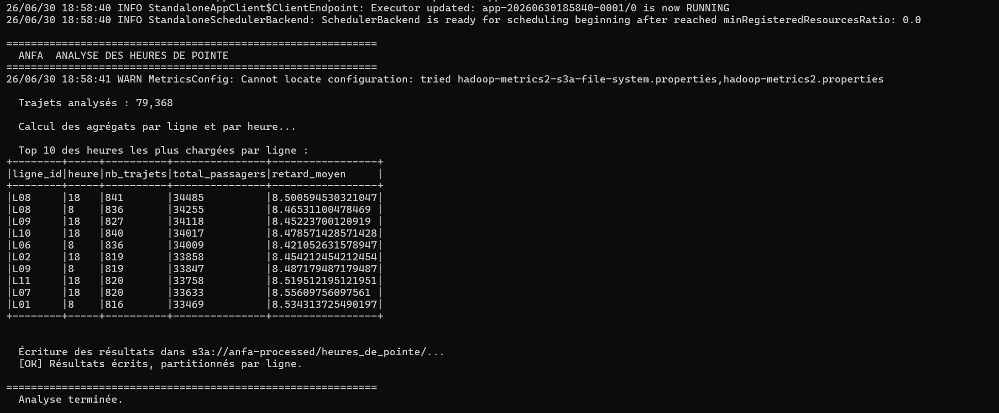
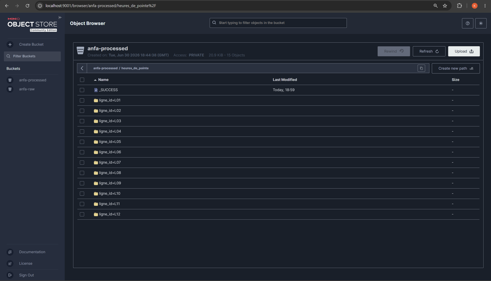

# Rendu - Seance 5

**Nom et prenom :** ALLAGLO Kossiko  
**Identifiant GitHub :** sunborndev  
**Date de soumission :** 30/06/2026

## Resume de la seance

Pendant cette seance, nous avons fait tourner une petite architecture Big Data locale avec Docker Compose : un cluster Spark standalone, compose d'un master et de deux workers, plus un stockage objet MinIO. L'objectif etait de sortir du mode local utilise dans les seances precedentes et de lancer les traitements PySpark sur un vrai cluster, meme si celui-ci reste local sur notre machine.

Nous avons aussi utilise MinIO comme stockage partage entre les services. Les donnees brutes sont stockees dans `anfa-raw`, puis les resultats produits par Spark sont ecrits dans `anfa-processed`, au format Parquet.

## Architecture mise en place

La stack Docker Compose contient quatre services principaux :

| Service | Role |
| --- | --- |
| `anfa-minio` | Stockage objet compatible S3 pour les donnees brutes et traitees. |
| `anfa-spark-master` | Noeud master Spark, responsable de recevoir les applications et de repartir le travail. |
| `anfa-spark-worker-1` | Worker Spark qui execute une partie des taches. |
| `anfa-spark-worker-2` | Deuxieme worker Spark pour avoir une execution distribuee. |

Le dashboard Spark etait accessible sur `http://localhost:8080`, et la console MinIO sur `http://localhost:9001`.

## Etapes realisees

1. Creation du dossier `seance-05`.
2. Recuperation des fichiers fournis pour la seance : `docker-compose.yml` et les scripts du dossier `jobs`.
3. Lancement du cluster avec `docker compose up -d`.
4. Verification du Spark Master avec deux workers actifs.
5. Creation des buckets MinIO `anfa-raw` et `anfa-processed`.
6. Creation d'un compte applicatif MinIO pour les jobs.
7. Upload des fichiers du referentiel dans `anfa-raw/referentiel/`.
8. Execution du job Spark d'analyse du referentiel sur le cluster.
9. Ecriture des premiers resultats dans `anfa-processed`.
10. Generation d'un historique simule de trajets sur 30 jours.
11. Execution du job Spark d'analyse des heures de pointe.
12. Ecriture des resultats en Parquet, partitionnes par `ligne_id`.

## Resultats observes

Le cluster Spark a bien demarre avec deux workers actifs :

```text
Alive Workers: 2
Cores in use: 2 Total, 0 Used
Memory in use: 2.0 GiB Total, 0.0 B Used
```

Le premier job Spark a analyse le referentiel Anfa depuis MinIO. Les resultats principaux etaient :

```text
Nombre de lignes        : 12
Nombre d'arrets uniques : 60
Nombre total de bus     : 100
Dont actifs             : 93
Capacite totale flotte  : 4538 places
```

Le job a ensuite ecrit les resultats dans :

```text
s3a://anfa-processed/bus_par_ligne
```

Pour la deuxieme partie, nous avons genere un historique de trajets simules. Le job des heures de pointe a analyse :

```text
Trajets analyses : 79,368
```

Le top 10 montre que les heures les plus chargees se concentrent surtout autour de 8h et 18h. C'est coherent avec une logique de transport urbain : le matin correspond aux departs vers le travail ou les cours, et 18h correspond aux retours.

Extrait du top 10 :

| ligne_id | heure | nb_trajets | total_passagers |
| --- | ---: | ---: | ---: |
| L08 | 18 | 841 | 34485 |
| L08 | 8 | 836 | 34255 |
| L09 | 18 | 827 | 34118 |
| L10 | 18 | 840 | 34017 |
| L06 | 8 | 836 | 34009 |

Les resultats finaux ont ete ecrits dans :

```text
s3a://anfa-processed/heures_de_pointe/
```

Dans MinIO, nous voyons bien une ecriture partitionnee par ligne :

```text
ligne_id=L01
ligne_id=L02
...
ligne_id=L12
```

## Captures d'ecran

### Dashboard Spark Master



Cette capture montre que le master Spark est actif et qu'il voit bien deux workers.

### Application Spark terminee



Cette capture confirme que l'application `Anfa - Analyse referentiel (cluster)` a ete executee jusqu'au bout avec l'etat `FINISHED`.

### Top 10 des heures de pointe



Cette capture montre le resultat du job Spark sur les trajets simules, avec les lignes et heures les plus chargees.

### Resultats partitionnes dans MinIO



Cette capture montre que les resultats sont bien stockes dans `anfa-processed/heures_de_pointe/`, avec une partition par ligne.

## Comparaison entre mode local et mode cluster

En mode local, Spark tourne dans un seul processus sur la machine. C'est suffisant pour apprendre, tester rapidement un script ou traiter un petit volume de donnees. Par contre, tout depend des ressources de la machine locale.

En mode cluster, le travail est envoye au master Spark, puis reparti vers plusieurs workers. Meme dans notre cas, avec un cluster local Docker, on voit mieux la logique d'un environnement Big Data : un noeud coordonne, plusieurs noeuds executent, et les donnees doivent etre accessibles depuis tous les conteneurs.

La difference importante n'est donc pas seulement la performance. C'est surtout la maniere de penser l'application : les chemins locaux ne suffisent plus, les dependances doivent etre disponibles pour les executors, et le stockage partage devient central.

## Reponses aux exercices d'application

### 1. Role du Spark Master

Le Spark Master ne fait pas le calcul principal lui-meme. Son role est de recevoir les applications Spark, de connaitre les workers disponibles et de repartir les ressources. Dans notre dashboard, c'est lui qui affiche les workers actifs, les applications en cours et les applications terminees.

### 2. Role des Spark Workers

Les workers executent les taches demandees par Spark. Dans notre cas, nous avions deux workers, chacun avec un coeur et 1 Gio de memoire. Lors du job, Spark a pu utiliser les deux workers, ce qui montre que l'application ne tournait plus seulement en local dans un seul processus.

### 3. Pourquoi utiliser MinIO avec Spark ?

MinIO joue le role d'un stockage objet compatible S3. C'est important dans un cluster, car les donnees doivent etre accessibles par le master et par les workers. Si nous utilisions seulement un chemin local Windows, les autres conteneurs ne sauraient pas forcement y acceder. Avec MinIO, les scripts lisent et ecrivent via des chemins `s3a://`, ce qui ressemble davantage a une architecture cloud.

### 4. Pourquoi ajouter les packages `hadoop-aws` et `aws-java-sdk-bundle` ?

Spark ne sait pas toujours parler a S3 ou MinIO directement avec une installation minimale. Le connecteur `hadoop-aws` ajoute le support du protocole `s3a://`, et le bundle AWS fournit les bibliotheques necessaires pour l'authentification et les appels S3 compatibles. Sans ces dependances, la lecture ou l'ecriture vers MinIO echouerait.

### 5. Interet du format Parquet

Le format Parquet est plus adapte aux traitements analytiques que le CSV. Il garde un schema, stocke les donnees en colonnes et permet a Spark de lire seulement les colonnes utiles. Pour des traitements Big Data, cela devient beaucoup plus efficace que relire des fichiers texte ligne par ligne.

### 6. Interet du partitionnement par `ligne_id`

Le partitionnement par `ligne_id` cree un dossier par ligne de bus. Si plus tard nous voulons analyser seulement la ligne `L08`, Spark peut lire directement la partition `ligne_id=L08` au lieu de parcourir tout le jeu de resultats. C'est une optimisation simple, mais tres utile quand le volume augmente.

### 7. Interpretation des heures de pointe

Les resultats montrent surtout des pics a 8h et 18h. Cela correspond a une situation assez realiste pour un reseau de bus : forte demande le matin, puis nouvelle forte demande en fin de journee. Comme les donnees sont simulees, il ne faut pas les presenter comme une observation reelle du terrain, mais elles permettent de valider la logique du traitement.

### 8. Limites de notre architecture

Notre cluster reste un environnement local Docker. Il permet de comprendre Spark standalone, les workers et MinIO, mais ce n'est pas encore une architecture de production. Il n'y a pas de haute disponibilite du master, les donnees sont sur un volume local, et les ressources restent limitees par la machine. En production, on utiliserait plutot une infrastructure plus robuste, avec supervision, securite plus stricte et gestion automatique de la scalabilite.

## Conclusion

Cette seance nous a permis de passer d'une execution PySpark locale a une execution distribuee sur un cluster Spark standalone. Nous avons vu que le plus gros changement n'est pas seulement de lancer plus de conteneurs : il faut aussi penser au stockage partage, aux dependances, aux formats de sortie et au partitionnement des resultats.

Le TP montre bien une logique Big Data complete : donnees brutes dans un bucket, traitement Spark distribue, puis resultats analytiques stockes dans un bucket de sortie.
