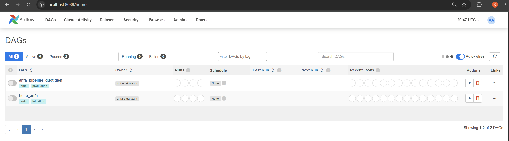
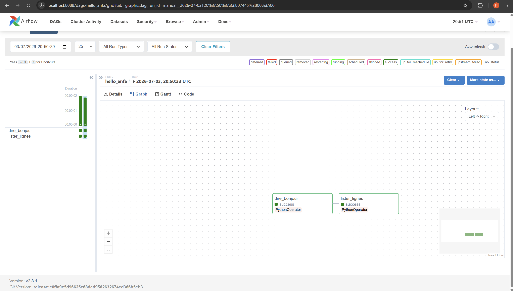
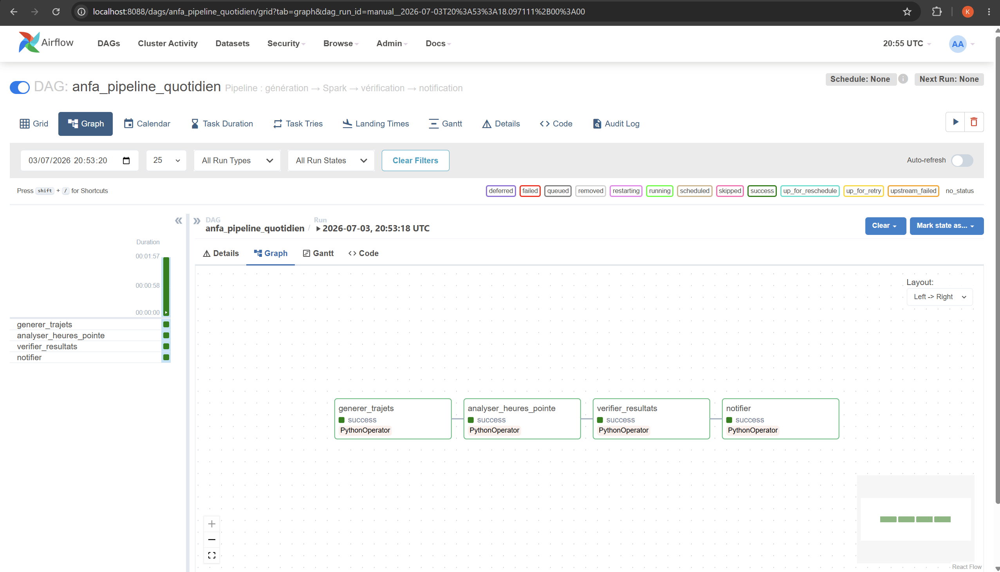
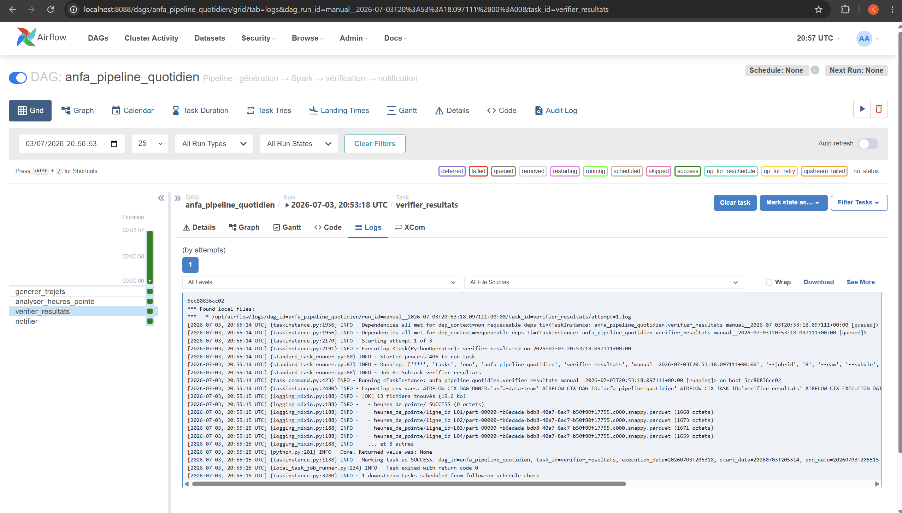
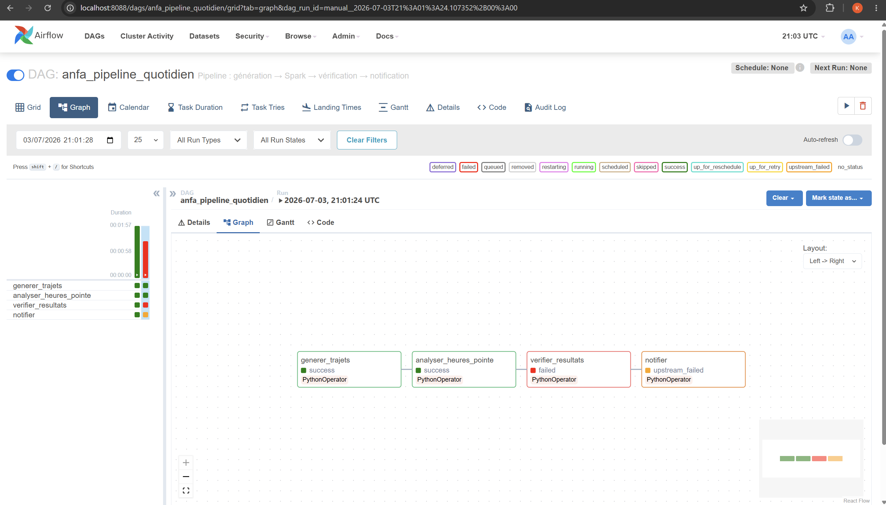

# Rendu : Séance 6

**Nom et prénom :** ALLAGLO Kossiko  
**Identifiant GitHub :** sunborndev  
**Date de soumission :** 03/07/2026

## Résumé de la séance

Pendant cette séance, nous avons ajouté Apache Airflow à la stack déjà utilisée
avec MinIO et Spark. L'objectif était de ne plus lancer les scripts un par un à
la main, mais de les organiser dans un vrai pipeline orchestré.

Nous avons d'abord exécuté un DAG simple, `hello_anfa`, pour comprendre la
mécanique de base : tâches, dépendances, déclenchement manuel, graph view et
logs. Ensuite, nous avons lancé un DAG métier plus complet,
`anfa_pipeline_quotidien`, qui reprend le pipeline de la séance 5 :
génération des trajets, analyse Spark des heures de pointe, vérification des
résultats dans MinIO, puis notification.

La dernière partie nous a permis de casser volontairement une tâche pour voir
comment Airflow gère les retries et comment un échec bloque les tâches en aval.

## Étapes principales

1. Déploiement de la stack (Airflow + PostgreSQL + MinIO + Spark) via Docker Compose.
2. Premier DAG `hello_anfa` à 2 tâches : initiation à la mécanique Airflow.
3. DAG métier `anfa_pipeline_quotidien` à 4 tâches : génération → Spark → vérification → notification.
4. Démonstration des retries et de la gestion d'erreur via un bug volontaire.
5. Réparation du DAG après la démonstration pour garder un pipeline final fonctionnel.

## Résultats observés

La stack finale contenait les services suivants :

- `anfa-postgres`, utilisé par Airflow pour stocker ses métadonnées ;
- `anfa-airflow-webserver`, pour accéder à l'interface web ;
- `anfa-airflow-scheduler`, pour détecter et exécuter les DAGs ;
- `anfa-minio`, pour stocker les données brutes et les résultats ;
- `anfa-spark-master` et `anfa-spark-worker`, pour exécuter les jobs Spark.

Dans Airflow, les deux DAGs sont apparus correctement. Le DAG `hello_anfa` a
validé la mécanique simple avec deux tâches enchaînées. Le DAG
`anfa_pipeline_quotidien` a ensuite exécuté le pipeline complet avec les quatre
tâches en succès.

La tâche `verifier_resultats` a confirmé que les fichiers Parquet produits par
Spark étaient bien présents dans MinIO. Cela montre que le pipeline n'a pas
seulement lancé un script : il a aussi contrôlé que le résultat attendu existait.

## Captures d'écran

### UI Airflow après connexion (vue d'accueil)


### DAG hello_anfa exécuté en succès


### DAG anfa_pipeline_quotidien complet en succès


### Logs de la tâche `verifier_resultats`


### Démonstration du retry : tâche en échec et propagation


## Réflexion personnelle

Airflow apporte plus qu'un simple déclenchement automatique. Avec un cron, on
peut lancer une commande à une heure donnée, mais on voit moins bien ce qui se
passe entre les étapes. Ici, Airflow nous donne une vue claire du pipeline :
quelle tâche a réussi, laquelle a échoué, combien de fois elle a été rejouée, et
où regarder les logs.

Sur un vrai projet, nous utiliserions Airflow quand plusieurs traitements
dépendent les uns des autres. Par exemple, il ne faut pas lancer l'analyse Spark
avant d'avoir généré ou reçu les données, et il ne faut pas notifier un succès si
la vérification des résultats a échoué. Airflow rend cette logique explicite.

La séance montre aussi pourquoi l'idempotence est importante. Une tâche peut être
relancée après un échec ou un retry. Elle doit donc pouvoir être rejouée sans
casser les données ou produire un résultat incohérent.

## Ce que nous avons compris

Un DAG Airflow décrit un enchaînement de tâches. Dans notre cas, la dépendance :

```python
t_generer >> t_analyser >> t_verifier >> t_notifier
```

signifie que chaque étape attend la réussite de la précédente. Si
`verifier_resultats` échoue, `notifier` ne doit pas s'exécuter, ce qui est le
comportement attendu.

Nous avons aussi compris que le job Spark ne tourne pas directement dans Airflow.
L'image Airflow ne contient pas Java ni Spark. Le DAG utilise donc le socket
Docker pour exécuter `spark-submit` dans le conteneur `anfa-spark-master`, où
l'environnement Spark est disponible.

## Difficultés rencontrées

Au lancement, PostgreSQL ne passait pas en `healthy` avec l'image
`postgres:18-alpine`. Les logs indiquaient un problème lié au chemin de données
utilisé par les images PostgreSQL 18. Pour avancer proprement dans le cadre du
TP, nous avons remplacé l'image par `postgres:16-alpine`, puis recréé les
volumes avec `docker compose down -v`. Après cela, la stack a démarré
normalement.

La stack est aussi plus lourde que les précédentes, car Airflow, PostgreSQL,
MinIO et Spark tournent en même temps. Il faut donc laisser quelques minutes aux
services pour démarrer, surtout lors du premier lancement.
