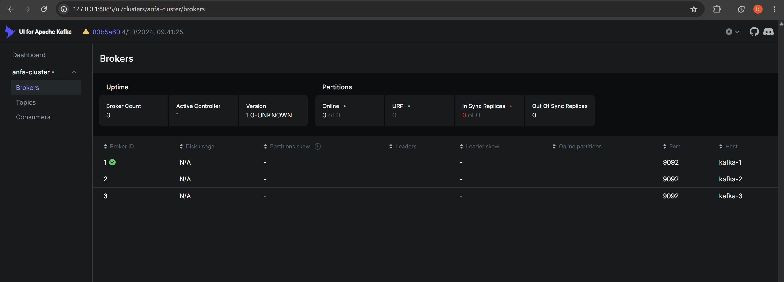
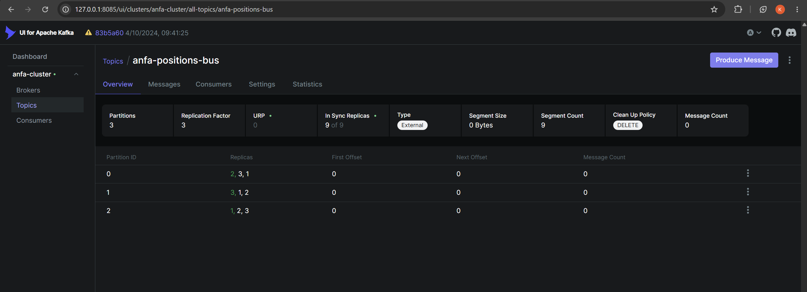
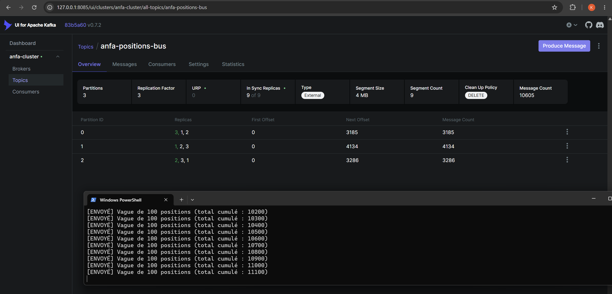
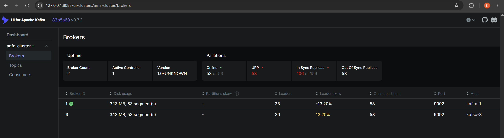
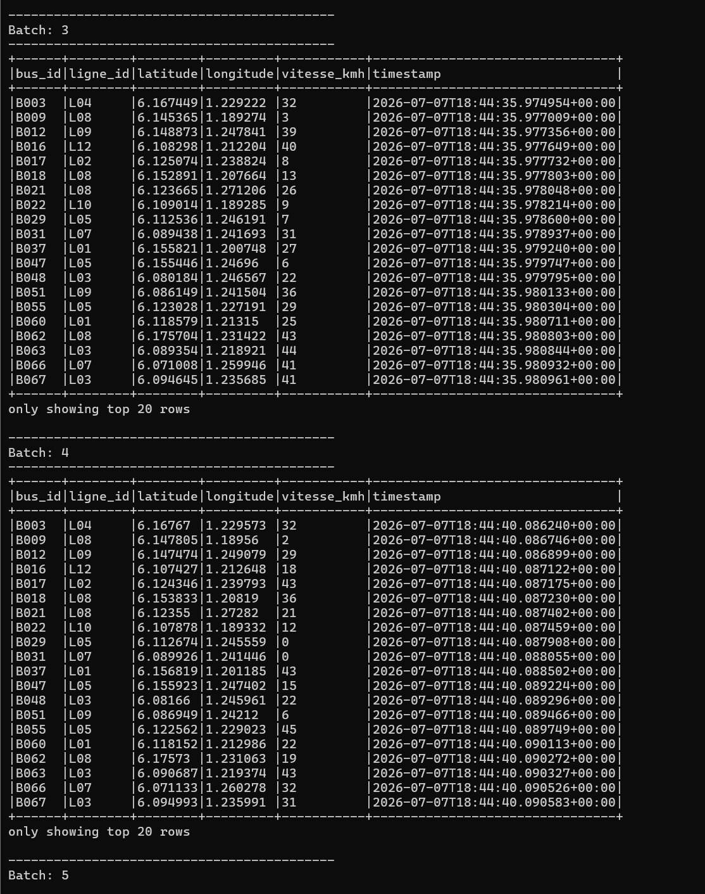
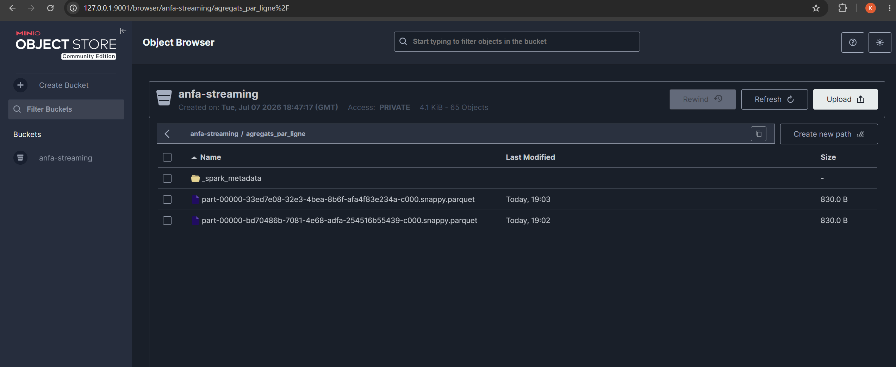

# Rendu - Séance 7

**Nom et prénom :** ALLAGLO Kossiko  
**Identifiant GitHub :** sunborndev  
**Date de soumission :** 07/07/2026

## Résumé de la séance

Pendant cette séance, nous avons ajouté une dimension temps réel à la plateforme
Anfa. Nous avons déployé un cluster Kafka à 3 brokers en mode KRaft, créé un
topic répliqué, puis simulé une flotte de 100 bus envoyant leur position GPS en
continu.

Nous avons ensuite consommé ce flux avec Spark Structured Streaming. D'abord,
nous avons affiché les positions en console pour valider la lecture Kafka. Puis
nous avons lancé une agrégation par fenêtre temporelle et écrit les résultats
dans MinIO au format Parquet.

## Étapes principales

1. Déploiement du cluster Kafka (3 brokers, mode KRaft) + Kafka UI.
2. Création du topic `anfa-positions-bus` (3 partitions, réplication 3).
3. Premier producer/consumer Python pour comprendre la mécanique.
4. Simulation de 100 bus envoyant leur position en continu.
5. Démonstration de tolérance aux pannes (arrêt d'un broker).
6. Spark Structured Streaming : lecture console, puis agrégation en fenêtre vers MinIO.

## Résultats observés

Le cluster Kafka a bien démarré avec 3 brokers actifs. Le topic
`anfa-positions-bus` a été créé avec :

- 3 partitions ;
- un facteur de réplication de 3 ;
- des répliques réparties sur les 3 brokers.

Le premier producer Python a envoyé 5 messages de test avec la même clé `B001`.
Le consumer les a relus depuis Kafka avec leurs partitions et offsets. Tous les
messages de test sont arrivés dans la même partition, ce qui montre l'intérêt de
la clé : elle garde l'ordre des messages pour un même bus.

Le simulateur a ensuite envoyé des vagues de 100 positions GPS en continu. Kafka
UI montrait l'augmentation du nombre de messages dans le topic.

Pour tester la tolérance aux pannes, nous avons arrêté volontairement
`anfa-kafka-2`. Le cluster est resté disponible avec 2 brokers actifs. Le flux a
continué, ce qui montre concrètement l'intérêt de la réplication à 3 brokers.

Enfin, Spark Structured Streaming a lu le flux Kafka en micro-batchs, puis le job
d'agrégation a écrit des fichiers Parquet dans :

```text
s3a://anfa-streaming/agregats_par_ligne/
```

## Captures d'écran

### 3 brokers actifs dans Kafka UI


### Topic partitionné et répliqué


### Débit de messages en augmentation


### Cluster avec 2 brokers sur 3 (après arrêt volontaire)


### Micro-batchs affichés en console par Spark


### Résultats agrégés dans MinIO


## Réflexion personnelle

Kafka et Spark Streaming deviennent utiles quand on veut traiter des données en
continu, sans attendre un fichier complet ou une exécution planifiée. Dans les
séances 5 et 6, le pipeline batch était adapté pour analyser des données déjà
présentes. Ici, les bus envoient leur position toutes les secondes : il faut donc
un système capable d'absorber un flux permanent.

La réplication à 3 brokers nous a aussi montré quelque chose de concret. Quand
nous avons arrêté un broker, le cluster n'a pas disparu. Les autres brokers
avaient déjà des copies des partitions et ont continué à servir le topic. Cela
rend Kafka beaucoup plus robuste qu'un simple script qui écrit dans un fichier.

Le couple Kafka + Spark Structured Streaming est donc pertinent pour des cas où
les données arrivent sans interruption : positions GPS, logs applicatifs,
transactions, capteurs IoT ou événements utilisateurs.

## Réponses aux exercices d'application

### 1. Pourquoi utiliser une clé Kafka comme `bus_id` ?

La clé `bus_id` permet à Kafka d'envoyer tous les messages d'un même bus dans la
même partition. Cela garantit l'ordre des positions pour ce bus. Sans clé, les
messages pourraient être répartis différemment, et l'ordre serait plus difficile
à interpréter.

### 2. À quoi servent les partitions ?

Les partitions permettent de découper un topic en plusieurs morceaux. Cela aide à
répartir la charge entre plusieurs brokers et à paralléliser la consommation.
Dans notre TP, le topic a 3 partitions, donc Kafka peut répartir le flux de
positions sur plusieurs partitions au lieu de tout mettre dans un seul journal.

### 3. À quoi sert le facteur de réplication ?

Le facteur de réplication indique combien de copies de chaque partition Kafka
conserve. Avec une réplication à 3, chaque partition existe sur les 3 brokers. Si
un broker tombe, une autre copie peut prendre le relais. C'est ce que nous avons
observé en arrêtant `anfa-kafka-2`.

### 4. Pourquoi le consumer ne relit pas toujours les anciens messages ?

Kafka mémorise les offsets par consumer group. Si un consumer avec le même
`group_id` a déjà lu les messages, il reprend après le dernier offset consommé.
Pour relire depuis le début, il faut utiliser un nouveau `group_id` ou réinitialiser
les offsets.

### 5. Différence entre batch et streaming

En batch, on traite un volume de données déjà disponible, par exemple un fichier
CSV ou Parquet. En streaming, on traite les données au fur et à mesure qu'elles
arrivent. Dans ce TP, Spark Structured Streaming lit Kafka en continu et produit
des résultats par micro-batchs.

### 6. Pourquoi utiliser un checkpoint Spark ?

Le checkpoint permet à Spark de mémoriser sa progression dans le flux. Si le job
redémarre, il peut reprendre à partir du bon endroit au lieu de recommencer au
hasard. C'est important pour éviter les pertes ou les doublons dans un traitement
streaming.

## Difficultés rencontrées

Nous avons rencontré un problème avec `localhost` depuis Windows. Kafka UI et les
scripts Python répondaient mieux avec `127.0.0.1`. Nous avons donc remplacé les
listeners externes Kafka et les `bootstrap_servers` des scripts Python par
`127.0.0.1`.

Le job d'agrégation Spark n'écrivait d'abord que `_spark_metadata` dans MinIO.
Deux points ont été vérifiés : le job console devait être arrêté pour libérer le
worker Spark, et le parsing du timestamp a été rendu plus fiable pour transformer
correctement les timestamps ISO en `event_time`.

Après correction et relance avec le simulateur actif, les fichiers Parquet sont
bien apparus dans `anfa-streaming/agregats_par_ligne/`.
