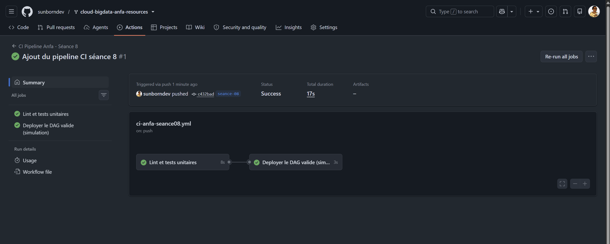
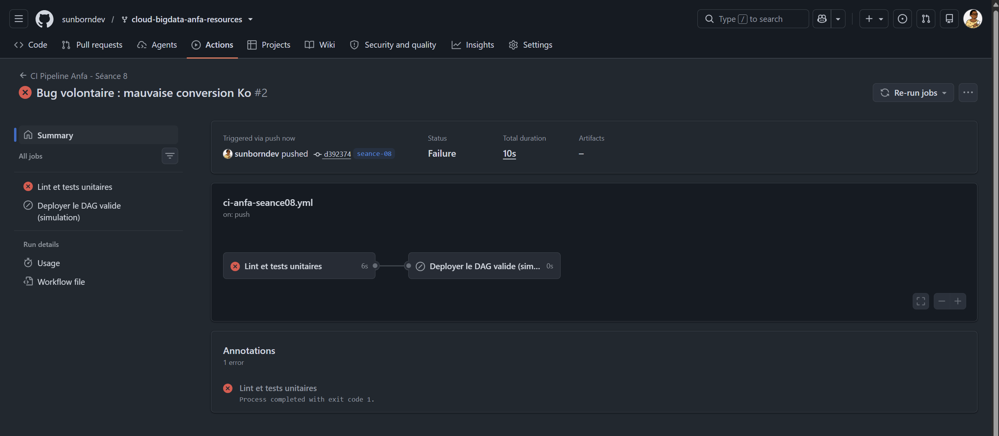

# Rendu - Séance 8

**Nom et prénom :** ALLAGLO Kossiko  
**Identifiant GitHub :** sunborndev  
**Date de soumission :** 07/07/2026

## Résumé de la séance

Pendant cette séance, nous avons travaillé sur la partie CI/CD du projet Anfa.
L'idée était de ne plus se contenter d'écrire un DAG Airflow, mais de vérifier
automatiquement qu'une partie de sa logique métier reste correcte avant chaque
push.

Nous avons séparé la logique métier dans un module Python testable, écrit des
tests unitaires avec `pytest`, puis mis en place un workflow GitHub Actions qui
lance automatiquement le lint et les tests. Nous avons aussi introduit un bug
volontaire pour vérifier que la CI bloque bien le déploiement simulé.

## Étapes principales

1. Séparation de la logique métier (`anfa_logic.py`) du DAG Airflow.
2. Écriture de 5 tests unitaires avec pytest.
3. Écriture du workflow GitHub Actions (lint + tests + déploiement simulé).
4. Démonstration : un bug volontaire bloque le déploiement ; correction et succès.

## Résultats observés

En local, les vérifications sont passées correctement avant le premier push :

```text
flake8 : OK
pytest : 5 passed
```

Après le push sur la branche `seance-08`, GitHub Actions a exécuté le workflow
`CI Pipeline Anfa - Séance 8`. Le premier run a réussi avec deux jobs :

- `Lint et tests unitaires` ;
- `Deployer le DAG valide (simulation)`.

Ensuite, nous avons introduit un bug volontaire dans la conversion des tailles :
division par `1000` au lieu de `1024`. Le test
`test_verifier_liste_fichiers_calcule_correctement` a échoué, et le job de
déploiement simulé n'a pas été exécuté. C'est exactement le comportement attendu.

Enfin, nous avons corrigé le bug en remettant la division par `1024`, puis les
tests locaux sont repassés au vert.

## Captures d'écran

### Workflow réussi (2 jobs)


### Job en échec, déploiement non exécuté


## Réflexion personnelle

Ce pipeline aurait aidé à éviter l'incident de Mawuli parce qu'une erreur simple,
comme une mauvaise conversion ou une logique métier cassée, aurait été détectée
avant le déploiement. Le développeur peut toujours écrire un bug, mais la CI
donne une barrière automatique avant que ce bug arrive dans l'environnement cible.

Le point important est aussi la séparation entre validation et déploiement. Le
job `deployer` dépend de `valider-dag` grâce à `needs:`. Concrètement, si le lint
ou les tests échouent, le déploiement ne démarre pas. On ne dépend donc pas
uniquement de la vigilance humaine.

Cette séance montre aussi pourquoi il est utile d'extraire la logique métier du
DAG Airflow. Tester directement un DAG complet demanderait d'installer Airflow,
ce qui rendrait la CI plus lourde. Ici, la partie importante est testée avec des
fonctions Python simples.

## Difficultés rencontrées

La principale attention à avoir était le placement du workflow GitHub Actions.
Le fichier doit être à la racine dans `.github/workflows/`, sinon GitHub ne le
détecte pas. Il fallait aussi faire attention au filtre `paths`, car le workflow
se déclenche seulement quand un fichier de `seance-08/` change.

Après correction du bug volontaire, nous avons relancé les tests localement pour
vérifier que le code final était redevenu propre.
