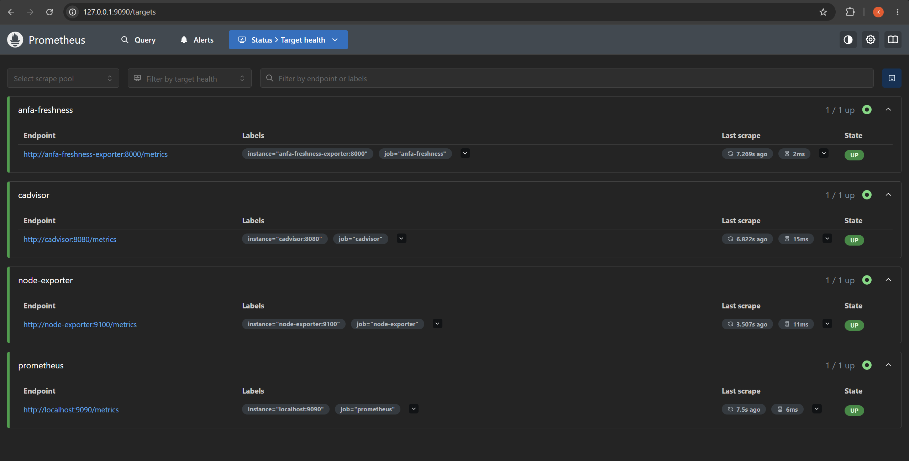
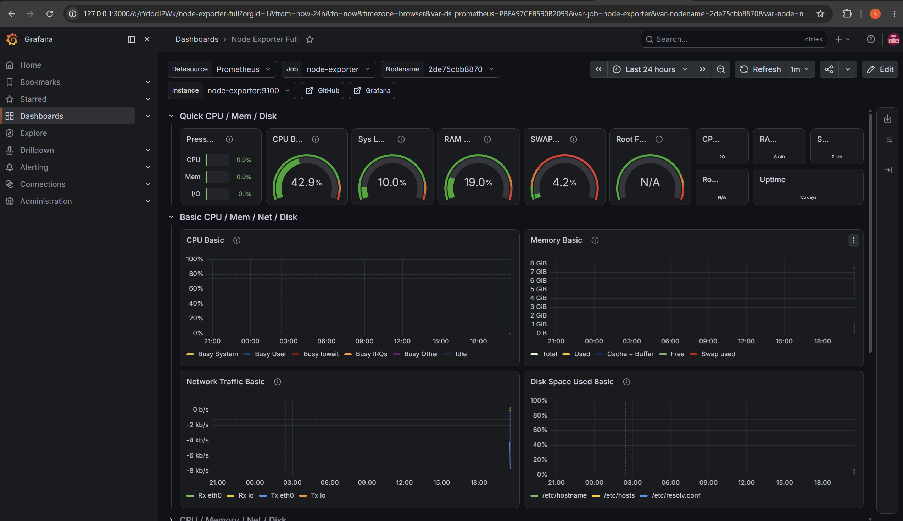
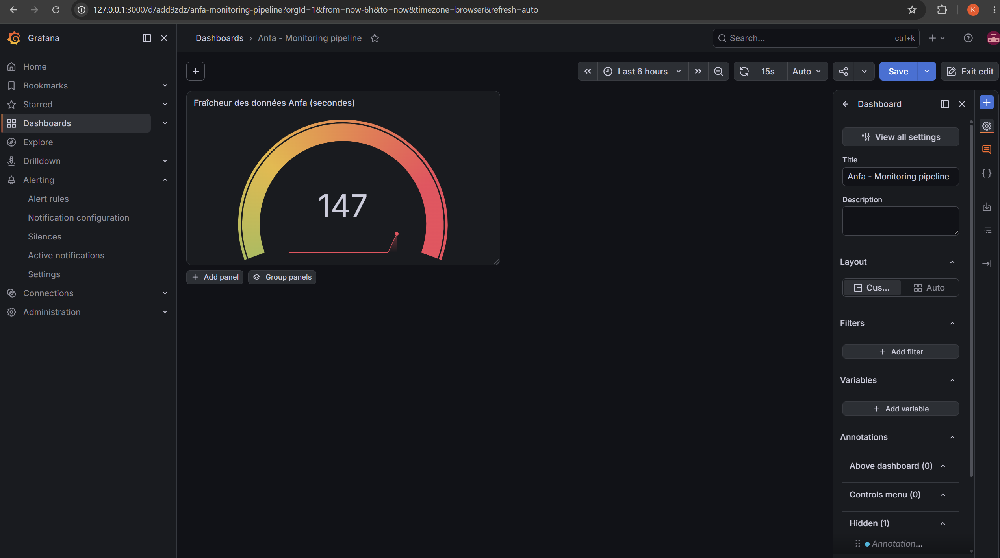

# Rendu - Séance 9

**Nom et prénom :** ALLAGLO Kossiko  
**Identifiant GitHub :** sunborndev  
**Date de soumission :** 07/07/2026

## Résumé de la séance

Pendant cette séance, nous avons mis en place une stack de monitoring locale
avec Prometheus, Grafana, Node Exporter, cAdvisor et un exportateur métier Anfa.
L'objectif était de ne pas seulement vérifier que les conteneurs tournent, mais
de surveiller une métrique vraiment utile pour le métier : la fraîcheur des
données.

Nous avons ensuite construit un dashboard Grafana, configuré une alerte, puis
simulé une panne silencieuse du pipeline. L'exportateur restait vivant, mais la
métrique de dernier traitement ne se mettait plus à jour, ce qui a fait monter la
fraîcheur jusqu'au déclenchement de l'alerte.

## Étapes principales

1. Déploiement de Prometheus, Node Exporter, cAdvisor, Grafana et d'un exportateur
   métier custom (fraîcheur des données Anfa).
2. Exploration des cibles Prometheus et premières requêtes PromQL.
3. Import du dashboard "Node Exporter Full" et construction d'un panneau custom.
4. Configuration d'une alerte Grafana sur la fraîcheur des données.
5. Simulation d'une panne silencieuse et observation du déclenchement de l'alerte.

## Résultats observés

Dans Prometheus, les quatre cibles étaient bien à l'état `UP` :

- `prometheus` ;
- `node-exporter` ;
- `cadvisor` ;
- `anfa-freshness`.

La requête PromQL utilisée pour mesurer la fraîcheur était :

```text
time() - anfa_dernier_traitement_timestamp
```

Quand le pipeline simulé fonctionne, cette valeur monte pendant quelques
secondes, puis redescend après chaque traitement réussi. Quand nous avons créé le
fichier sentinelle `/tmp/anfa_en_panne`, l'horodatage n'était plus mis à jour. La
valeur de fraîcheur a donc continué à monter jusqu'à dépasser le seuil de
l'alerte.

Dans Grafana, nous avons importé le dashboard `Node Exporter Full` pour observer
les métriques système, puis créé un dashboard métier `Anfa - Monitoring
pipeline` avec une jauge sur la fraîcheur des données. L'alerte est passée en
`Firing` après la panne simulée.

## Captures d'écran

### Les 4 cibles Prometheus à l'état UP


### Dashboard "Node Exporter Full" importé


### Alerte à l'état Firing après panne simulée


## Réflexion personnelle

Cette séance répond directement à la situation-problème d'Awa : un système peut
sembler fonctionner parce que les conteneurs sont `Up`, alors que les données ne
sont plus fraîches. Les métriques classiques comme CPU, RAM ou statut Docker ne
suffisent donc pas toujours.

La métrique de fraîcheur nous donne une information métier : depuis combien de
temps le dernier traitement utile a réussi. C'est beaucoup plus parlant pour une
plateforme de données. Si cette valeur monte sans jamais redescendre, cela veut
dire que le pipeline ne produit plus de résultat récent, même si l'infrastructure
a l'air en bonne santé.

L'intérêt de Grafana est aussi de rendre cette situation visible rapidement. Une
jauge avec des seuils vert, orange et rouge donne une lecture simple, et l'alerte
permet d'éviter d'attendre qu'un utilisateur découvre le problème.

## Difficultés rencontrées

La configuration de l'alerte Grafana demandait un peu d'attention, car la
fonction `last()` ne devait pas être écrite directement dans la requête PromQL.
La requête devait rester :

```text
time() - anfa_dernier_traitement_timestamp
```

Puis Grafana appliquait lui-même la condition `Last of query A is above 90`.

Nous avons aussi attendu que la panne simulée dépasse réellement le seuil avant
de voir l'alerte passer en `Pending`, puis en `Firing`. Après la capture, nous
avons supprimé le fichier `/tmp/anfa_en_panne` pour remettre le pipeline simulé
en état normal.
